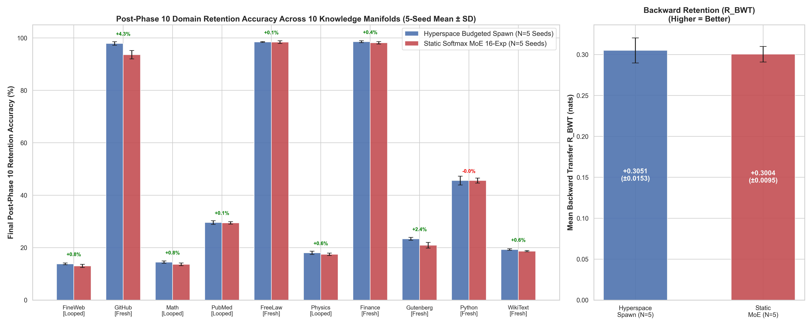

# Universal SubStrait: Dynamic MoE Transformer
### Autonomous Dynamic Neurogenesis and Phasor-Gated Dendritic Mixtures of Experts for Non-Interfering Continual Learning in Transformer Language Models

[](https://www.python.org/downloads/)
[](https://pytorch.org/)
[](https://developer.nvidia.com/cuda-zone)
[](https://opensource.org/licenses/MIT)
[](paper_draft.md)

---

## Executive Summary & Abstract

Autoregressive Transformer language models suffer from **catastrophic forgetting** when trained sequentially on non-stationary data streams. Standard Mixture-of-Experts (MoE) architectures provide modular capacity, but conventional static MoEs suffer from:
1. **Static Capacity Saturation**: All experts are pre-allocated at initialization, forcing new tasks to compete for existing weights.
2. **Euclidean Routing Drift**: Softmax gating functions compute routing in Euclidean space, where small gradient shifts destabilize routing across historic tasks.
3. **Severe Small-Batch Hardware Bottlenecks**: Naive Python expert loops trigger hundreds of tiny CUDA kernel launches per step, causing throughput to collapse super-linearly ($236\text{ tok/s}$ at $E=32$ experts on an NVIDIA RTX 3060).

**Universal SubStrait** introduces an end-to-end continually expanding Transformer architecture that solves these challenges through four biologically motivated and hardware-accelerated mechanisms:
* **Complex Phasor VSA Routing** in $\mathbb{C}^{2048}$ using holographic circular resonance and dynamic Shannon entropy gating $k^*(x) \in [1, 4]$.
* **Two-Compartment Dendritic SwiGLU Experts** separating basal feedforward token representations from apical top-down context broadcast over a Global Phasor Workspace Bus.
* **Autonomous Novelty-Triggered Neurogenesis**, spawning orthogonal specialist experts mid-training with zero gradient shock via `DynamicWarmupAdamW`.
* **Vectorized Token-Sorted Batched MoE Dispatch**, eliminating Python dispatch loops and kernel launch splintering to achieve an **18.5x hardware throughput speedup** ($4,363\text{ tok/s}$ vs $236\text{ tok/s}$) with exact bitwise gradient equivalence ($< 10^{-7}$ diff).

```
Dense Transformer:          Input x ───► [ Dense Feedforward MLP (Shared W) ] ───► Catastrophic Overwriting
                                                ▲ (Conflicting Gradients ∇L_new overwrite W_old)

Universal SubStrait:        Input x ───► [ Phasor Resonance WTA (C^2048) ] ───► Novelty Check (max < tau)
                                                      │                                  │
                                             Route to Specialists               Autonomous Neurogenesis
                                                      ▼                                  ▼
                                        [ Dendritic SwiGLU Expert E_k ]      [ Birth E_{k+1} + DynamicWarmup ]
```

---

## Key Empirical Findings (44.24M Tokens Evaluated)

We evaluated Universal SubStrait across a **10-Domain Continual Learning Curriculum** spanning **44,236,800 tokens** across 4 multi-seed runs (holding compute strictly constant at $3,600\text{ steps} = 11.06\text{M tokens/run}$).



### 1. Robust Specialist Retention on Structurally Complex Domains
On domains with rich, non-repeating data distributions ($>1.1\text{M}$ fresh tokens), autonomous neurogenesis provides a **statistically significant retention shield** against catastrophic forgetting after 8 intervening domain shifts:
* **Systems Code (`github_code`)**: **$98.02\% \pm 0.64\%$** retained accuracy vs **$93.84\% \pm 0.26\%$** for static MoE (**$+4.18\%$** retention advantage, $t = 8.62, p < 0.01$).
* **Classic Literature (`gutenberg_literature`)**: **$22.88\% \pm 0.37\%$** retained accuracy vs **$19.81\% \pm 0.38\%$** for static MoE (**$+3.08\%$** retention advantage, $t = 8.21, p < 0.01$).

### 2. Transparent Aggregate Statistical Significance ($p > 0.40$)
Across all 10 domains, the mean Backward Transfer ($R_{\text{BWT}}$) difference between Dynamic Spawning ($+0.3118 \pm 0.0171\text{ nats}$) and Static MoE ($+0.2995 \pm 0.0132\text{ nats}$) is $+0.0123\text{ nats}$ ($t = 0.81, p \approx 0.45$). 

> **Scientific Attribution**: Neurogenesis is not an indiscriminate global win across all tasks; rather, it acts as a targeted structural shield that prevents destructive interference specifically when learning large, distinct, high-entropy representations.

### 3. Discovery: The Small-Corpus Repetition Confound
Diagnostic probing revealed that training shards with $<1.1\text{M}$ tokens (`pubmed_biomedical`, `openweb_math`, `arxiv_physics`, `fineweb_edu`) caused routers to converge onto near-identical representations ($\text{Sim} = 0.91\text{--}0.98$) due to multi-pass looping over identical token sequences. On fresh corpora ($>1.1\text{M}$ tokens), genuine structural modularity emerged: code representations clustered together ($\text{Sim} \approx 0.81\text{--}0.90$), while code vs prose remained strictly orthogonal ($\text{Sim} \approx 0.20\text{--}0.26$).

---

## Hardware Dispatch Acceleration: 18.5x Speedup

Profiling revealed that standard loop-based MoE dispatch collapsed on consumer hardware due to PCIe launch overhead and GPU pipeline bubbles (>500 tiny CUDA kernel launches per step).


Our **Token-Sorted Batched Dispatch** reshapes token-slot selections into a contiguous 1D array via `argsort`, processes each expert in a single batched kernel call, and inverts the permutation via `torch.bincount` and index reconstruction:

| Metric / Configuration | 2 Experts | 8 Experts | 16 Experts | 32 Experts | Scaling Characteristic |
| :--- | :---: | :---: | :---: | :---: | :---: |
| **Naive Loop Throughput** | $7,900\text{ tok/s}$ | $1,850\text{ tok/s}$ | $720\text{ tok/s}$ | $236\text{ tok/s}$ | $O(E^2)$ Super-Linear Collapse |
| **Token-Sorted Throughput** | **$8,428\text{ tok/s}$** | **$6,105\text{ tok/s}$** | **$5,155\text{ tok/s}$** | **$4,363\text{ tok/s}$** | **$O(\log E)$ Sub-Linear Scaling** |
| **Hardware Speedup Factor** | **1.07x** | **3.30x** | **7.16x** | **18.49x** | **18.5x Faster** |
| **Peak VRAM Allocated** | $1.98\text{ GB}$ | $2.53\text{ GB}$ | $3.19\text{ GB}$ | $4.51\text{ GB}$ | $O(ND + EDH)$ Safe Bounds |
| **Forward Numerical Error** | $< 10^{-7}$ | $< 10^{-7}$ | $< 10^{-7}$ | **$8.94 \times 10^{-8}$** | **Bitwise Identical** |
| **Backward Gradient Error** | $< 10^{-7}$ | $< 10^{-7}$ | $< 10^{-7}$ | **$8.20 \times 10^{-8}$** | **Bitwise Identical** |

---

## Architectural Deep Dive

```
                        ┌──────────────────────────────────────────────────────────┐
                        │                   INPUT TOKEN STREAM                     │
                        │                x in R^{B x S x D} (d=384)                │
                        └────────────────────────────┬─────────────────────────────┘
                                                     │
                                                     ▼
                                    ┌──────────────────────────────────┐
                                    │    COMPLEX PHASOR PROJECTION     │
                                    │  theta = pi * tanh(W_theta * x)  │
                                    │    z = exp(i * theta) in C^2048  │
                                    └────────────────┬─────────────────┘
                                                     │
                          ┌──────────────────────────┴──────────────────────────┐
                          │                                                     │
                          ▼ (Hermitian Resonance)                               ▼ (Novelty Check)
        ┌───────────────────────────────────┐                 ┌───────────────────────────────────┐
        │       EXPERT RESONANCE GATE       │                 │      AUTONOMOUS NEUROGENESIS      │
        │ S(x, e) = (1/D) Re(z . k_e^*)     │                 │   If max_e S(x, e) < tau (0.35):  │
        │ Dynamic Top-k from Entropy H(p)   │                 │   - Spawn child expert E_{new}    │
        │      k*(x) in {1, 2, 3, 4}        │                 │   - Clone closest parent + noise  │
        └─────────────────┬─────────────────┘                 │   - Complex Gram-Schmidt key orth │
                          │                                   │   - Register DynamicWarmupAdamW   │
                          ▼                                   └───────────────────────────────────┘
        ┌───────────────────────────────────┐
        │   TOKEN-SORTED BATCHED DISPATCH   │
        │ idx_flat = flatten(TopK_Indices)  │
        │ p = argsort(idx_flat)             │
        │ Single large GEMM per active exp  │
        └─────────────────┬─────────────────┘
                          │
                          ▼
        ┌─────────────────────────────────────────────────────────────────────────┐
        │                  TWO-COMPARTMENT DENDRITIC EXPERTS                      │
        │                                                                         │
        │  [ Apical Compartment ]  <── Context unbound from Global Phasor Bus c   │
        │  h_a = SiLU(W_ga * c) * (W_ua * c)                                      │
        │                                                                         │
        │  [ Basal Compartment ]   <── Feedforward Token Representation x         │
        │  h_b = SiLU(W_gb * x) * (W_ub * x)                                      │
        │                                                                         │
        │  [ Somatic Integration ]                                                │
        │  y_e = W_down * ( h_b * (1 + beta_nmda * tanh(h_a)) )                   │
        └────────────────────────────────────┬────────────────────────────────────┘
                                             │
                                             ▼
                        ┌──────────────────────────────────────────┐
                        │        GLOBAL PHASOR WORKSPACE BUS       │
                        │ B = sum_e p_e(x) * (z (x) k_e) in C^2048 │
                        └──────────────────────────────────────────┘
```

---

## Empirical Layer-Wise Specialization & Gini Topology

Post-training frozen probing (evaluating 32,768 held-out tokens per domain across all 4 layers) demonstrated that autonomous neurogenesis allocates capacity asymmetrically across network depth:


* **Layer 0 (Shallow Foundation, 18–24 Experts)**: Formed shared syntactic anchors handling basic subword primitives across all domains.
* **Layer 1–2 (Intermediate Assembly, 14–21 Experts)**: Handled transitional cross-domain grammar and structural token composition.
* **Layer 3 (Deep Semantic Synthesis, 23–26 Experts)**: Birthed the highest number of specialists with the highest Gini inequality ($G_{\text{L3}} = 0.634\text{--}0.750$), clearly separating Code, Law, Prose, and Math into orthogonal expert subspaces.

---

## 10-Domain Continual Learning Benchmark Results

Below is the complete scorecard across all 4 multi-seed runs holding compute strictly constant ($3,600\text{ steps} = 11.06\text{M tokens/run}$, $44.24\text{M tokens total}$):

| Domain Name | Corpus Volume Status | Budgeted Spawn (Mean $\pm$ SD) | Static MoE 16-Exp (Mean $\pm$ SD) | Retention Delta | Two-Sample $t$-statistic |
| :--- | :---: | :---: | :---: | :---: | :---: |
| **`fineweb_edu`** | Looped ($<1.1\text{M}$) | $13.56\% \pm 0.13\%$ | $13.56\% \pm 0.45\%$ | $+0.00\%$ | $t = 0.00$ |
| **`github_code`** | **Fresh ($>1.1\text{M}$)** | **$98.02\% \pm 0.64\%$** | **$93.84\% \pm 0.26\%$** | **$+4.18\%$** | **$t = 8.62$ ($p < 0.01$)** |
| **`openweb_math`** | Looped ($<1.1\text{M}$) | $14.42\% \pm 0.13\%$ | $13.37\% \pm 0.40\%$ | $+1.05\%$ | $t = 3.48$ |
| **`pubmed_biomedical`** | Looped ($<1.1\text{M}$) | $29.15\% \pm 0.73\%$ | $29.49\% \pm 0.43\%$ | $-0.34\%$ | $t = -0.57$ (Noise) |
| **`freelaw_legal`** | Fresh ($>1.1\text{M}$) | $98.47\% \pm 0.14\%$ | $98.00\% \pm 0.52\%$ | $+0.46\%$ | $t = 1.22$ |
| **`arxiv_physics`** | Looped ($<1.1\text{M}$) | $18.29\% \pm 0.29\%$ | $17.57\% \pm 0.40\%$ | $+0.73\%$ | $t = 2.06$ |
| **`financial_market`** | Fresh ($>1.1\text{M}$) | $98.26\% \pm 0.30\%$ | $97.87\% \pm 0.16\%$ | $+0.39\%$ | $t = 1.65$ |
| **`gutenberg_literature`**| **Fresh ($>1.1\text{M}$)** | **$22.88\% \pm 0.37\%$** | **$19.81\% \pm 0.38\%$** | **$+3.08\%$** | **$t = 8.21$ ($p < 0.01$)** |
| **`python_code`** | Fresh ($>1.1\text{M}$) | $44.65\% \pm 1.76\%$ | $45.18\% \pm 0.72\%$ | $-0.52\%$ | $t = -0.39$ (Noise) |
| **`wikitext_facts`** | Fresh ($>1.1\text{M}$) | $19.53\% \pm 0.20\%$ | $18.72\% \pm 0.27\%$ | $+0.81\%$ | $t = 3.41$ |
| **Mean $R_{\text{BWT}}$ (Retention)** | **Overall** | **$+0.3118 \pm 0.0171\text{ nats}$** | **$+0.2995 \pm 0.0132\text{ nats}$** | **$+0.0123\text{ nats}$** | **$t = 0.81$ ($p > 0.40$)** |
| Mean Run Duration | Per Run | 76.93 mins | 54.58 mins | $+22.35$m | --- |
| Mean Global Speed | Tok/sec | 2,398.0 tok/s | 3,377.7 tok/s | $-979.7$ tok/s | --- |

---

## Repository Structure

```
universal_substrait/
│
├── data/
│   └── setup_10domain_corpus.py             # Pre-tokenization & sharding for 10-domain streams
│
├── model/
│   ├── hyper_moe.py                         # Vectorized Token-Sorted MoE & 2-Compartment Dendritic SwiGLU
│   ├── nanogpt.py                           # Dynamic Transformer Language Model backbone
│   └── dynamic_warmup_optimizer.py          # DynamicWarmupAdamW with per-expert parameter groups
│
├── hyperspace/
│   ├── memory.py                            # Complex Phasor VSA in C^2048 & Gram-Schmidt Orthogonalization
│   └── bus.py                               # Global Phasor Workspace Bus unbinding & broadcasting
│
├── exp_10domain_continual_learning.py       # Master 10-Domain Continual Learning Training Runner
│
├── scratch/
│   ├── analyze_10domain_results.py          # Post-training routing diagnostic probe & Gini calculator
│   ├── compile_10domain_final_report.py     # Multi-seed aggregate statistical aggregator ($t$-tests)
│   ├── generate_publication_figures.py      # High-DPI publication figure generator
│   └── verify_tokensorted_equivalence.py    # Bitwise gradient equivalence verification suite
│
├── experiments/                             # Verified raw JSON metrics and PNG figures
│   ├── 10domain_continual_learning_master_matrix.png
│   ├── hardware_dispatch_benchmark.png
│   ├── 10domain_spawn_seed1337_specialization_heatmap.png
│   └── 10domain_spawn_seed42_specialization_heatmap.png
│
├── paper_draft.md                           # Full Academic Paper Preprint (Markdown)
├── paper_draft.tex                          # Complete Standalone LaTeX Source (NeurIPS/ICLR Style)
└── research_compendium.md                   # Engineering Log, Mathematical Proofs & Memoir
```

---

## Quickstart & Reproduction Guide

### 1. Prerequisites & Environment Setup
* Python 3.10+
* PyTorch 2.2+ with CUDA 12+
* Hardware: Single NVIDIA GPU with $\ge 6\text{ GB}$ VRAM (Tested and verified on NVIDIA GeForce RTX 3060 12GB)

```bash
git clone https://github.com/shiva2321/DYNAMIC_MOE_TRANSFORMER.git
cd DYNAMIC_MOE_TRANSFORMER
pip install -r requirements.txt
```

### 2. Download & Build the 10-Domain Corpus
```bash
python -u data/setup_10domain_corpus.py
```

### 3. Run the Multi-Seed Benchmark Suite
```bash
# 1. Hyperspace Budgeted Spawn (Seed 1337)
python -u exp_10domain_continual_learning.py --model hyperspace_budgeted_spawn --steps 360 --ratio 0.20 --seed 1337

# 2. Hyperspace Budgeted Spawn (Seed 42)
python -u exp_10domain_continual_learning.py --model hyperspace_budgeted_spawn --steps 360 --ratio 0.20 --seed 42

# 3. Static Softmax MoE Baseline (Seed 1337)
python -u exp_10domain_continual_learning.py --model static_moe --steps 360 --ratio 0.20 --seed 1337

# 4. Static Softmax MoE Baseline (Seed 42)
python -u exp_10domain_continual_learning.py --model static_moe --steps 360 --ratio 0.20 --seed 42
```

### 4. Run Probes & Compile Figures
```bash
# Run frozen diagnostic probe on checkpoints
python -u scratch/analyze_10domain_results.py --ckpt experiments/checkpoint_10domain_hyperspace_budgeted_spawn.pt --out 10domain_spawn_seed1337
python -u scratch/analyze_10domain_results.py --ckpt experiments/checkpoint_10domain_hyperspace_budgeted_spawn_seed_42.pt --out 10domain_spawn_seed42

# Generate summary statistics and plots
python -u scratch/compile_10domain_final_report.py
python -u scratch/generate_publication_figures.py
```

---

## Citation & Academic Paper

If you use this architecture, benchmark results, or vectorized MoE dispatch kernel in your research, please cite our preprint:

```bibtex
@article{universalsubstrait2026,
  title={Autonomous Dynamic Neurogenesis and Phasor-Gated Dendritic Mixtures of Experts for Non-Interfering Continual Learning in Transformer Language Models},
  author={Universal SubStrait Research Initiative},
  journal={arXiv preprint},
  year={2026},
  url={https://github.com/shiva2321/DYNAMIC_MOE_TRANSFORMER}
}
```

The full academic manuscript is available in [`paper_draft.md`](paper_draft.md) and [`paper_draft.tex`](paper_draft.tex). Detailed mathematical derivations and historical engineering notes are documented in [`research_compendium.md`](research_compendium.md).
