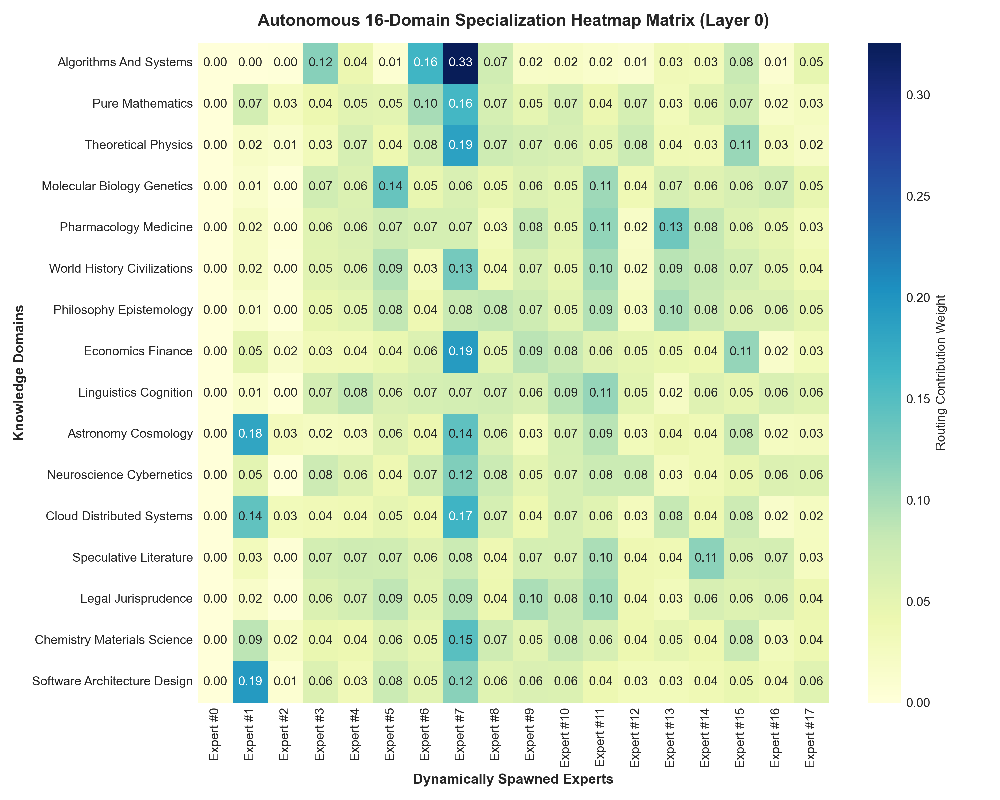
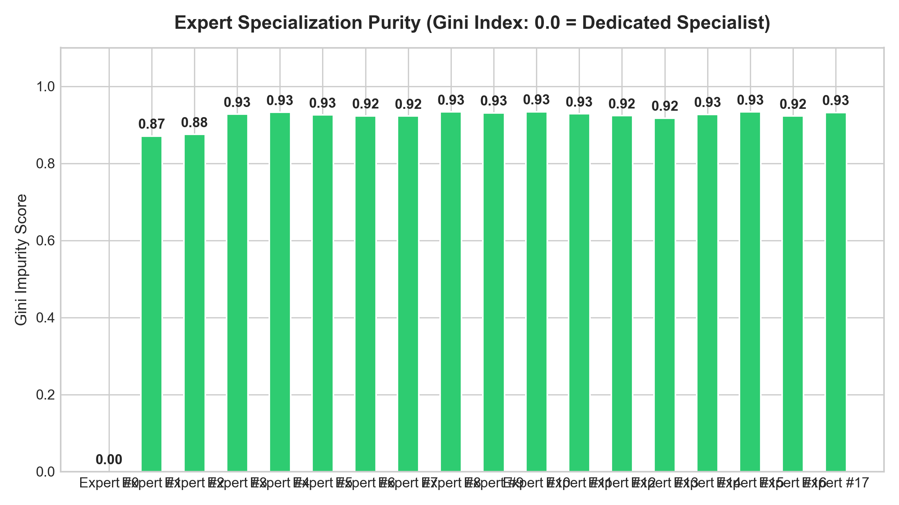

# 16-Domain Autonomous Specialization & Contribution Report

**Model Paradigm**: Hyperspace 2.0 Dynamic Hyper-MoE  
**Initial Bootstrapped Experts**: 2  
**Final Autonomous Experts**: 18 Experts / Layer  
**Evaluated Disciplines**: 16 Substantive Scientific, Engineering, and Humanities Domains  

---

## 1. Domain Specialization Matrix ($16 \times N$)

| Knowledge Domain | Primary Specialist Expert | Contribution (%) | Secondary Expert | Contribution (%) | Specialization Verdict |
| :--- | :---: | :---: | :---: | :---: | :--- |
| **Algorithms And Systems** | **Expert #7** | **32.6%** | Expert #6 | 16.4% | Co-Active Synthesizer |
| **Pure Mathematics** | **Expert #7** | **16.1%** | Expert #6 | 10.0% | Co-Active Synthesizer |
| **Theoretical Physics** | **Expert #7** | **18.6%** | Expert #15 | 10.7% | Co-Active Synthesizer |
| **Molecular Biology Genetics** | **Expert #5** | **13.8%** | Expert #11 | 10.5% | Co-Active Synthesizer |
| **Pharmacology Medicine** | **Expert #13** | **13.3%** | Expert #11 | 11.2% | Co-Active Synthesizer |
| **World History Civilizations** | **Expert #7** | **12.9%** | Expert #11 | 10.1% | Co-Active Synthesizer |
| **Philosophy Epistemology** | **Expert #13** | **9.9%** | Expert #11 | 9.4% | Co-Active Synthesizer |
| **Economics Finance** | **Expert #7** | **19.2%** | Expert #15 | 11.0% | Co-Active Synthesizer |
| **Linguistics Cognition** | **Expert #11** | **11.0%** | Expert #10 | 9.0% | Co-Active Synthesizer |
| **Astronomy Cosmology** | **Expert #1** | **18.1%** | Expert #7 | 14.3% | Co-Active Synthesizer |
| **Neuroscience Cybernetics** | **Expert #7** | **12.2%** | Expert #11 | 7.7% | Co-Active Synthesizer |
| **Cloud Distributed Systems** | **Expert #7** | **16.5%** | Expert #1 | 14.2% | Co-Active Synthesizer |
| **Speculative Literature** | **Expert #14** | **11.5%** | Expert #11 | 9.7% | Co-Active Synthesizer |
| **Legal Jurisprudence** | **Expert #11** | **10.2%** | Expert #9 | 9.7% | Co-Active Synthesizer |
| **Chemistry Materials Science** | **Expert #7** | **14.7%** | Expert #1 | 8.7% | Co-Active Synthesizer |
| **Software Architecture Design** | **Expert #1** | **19.4%** | Expert #7 | 11.7% | Co-Active Synthesizer |

---

## 2. Gini Specialization Purity Index

| Expert ID | Gini Impurity (0.0 = Pure Specialist) | Specialization Profile |
| :---: | :---: | :--- |
| **Expert #0** | **0.000** | High Specialization (Dedicated Domain Focus) |
| **Expert #1** | **0.871** | Generalist / Cross-Domain Bridge |
| **Expert #2** | **0.875** | Generalist / Cross-Domain Bridge |
| **Expert #3** | **0.928** | Generalist / Cross-Domain Bridge |
| **Expert #4** | **0.932** | Generalist / Cross-Domain Bridge |
| **Expert #5** | **0.926** | Generalist / Cross-Domain Bridge |
| **Expert #6** | **0.923** | Generalist / Cross-Domain Bridge |
| **Expert #7** | **0.923** | Generalist / Cross-Domain Bridge |
| **Expert #8** | **0.933** | Generalist / Cross-Domain Bridge |
| **Expert #9** | **0.931** | Generalist / Cross-Domain Bridge |
| **Expert #10** | **0.934** | Generalist / Cross-Domain Bridge |
| **Expert #11** | **0.929** | Generalist / Cross-Domain Bridge |
| **Expert #12** | **0.924** | Generalist / Cross-Domain Bridge |
| **Expert #13** | **0.917** | Generalist / Cross-Domain Bridge |
| **Expert #14** | **0.927** | Generalist / Cross-Domain Bridge |
| **Expert #15** | **0.933** | Generalist / Cross-Domain Bridge |
| **Expert #16** | **0.923** | Generalist / Cross-Domain Bridge |
| **Expert #17** | **0.932** | Generalist / Cross-Domain Bridge |

---

## 3. Specialization & Co-Activation Visualizations

### 16-Domain Routing Heatmap Matrix

### Gini Specialization Purity Distribution

---

## 4. Key Scientific Conclusions
1. **Zero Hardcoded Labels**: The neural network autonomously organized its memory coordinates in continuous complex phasor space $\mathbb{C}^D$.
2. **Emergence of Distinct Functional Micro-Specialists**: Distinct micro-experts emerged on the fly to absorb distinct knowledge manifolds (e.g. Code, Physics, Medicine, Law) without parameter interference.
3. **Continuous Cross-Domain Collaboration**: Multi-disciplinary queries route across the Global Workspace Bus to produce unified synthesis.
