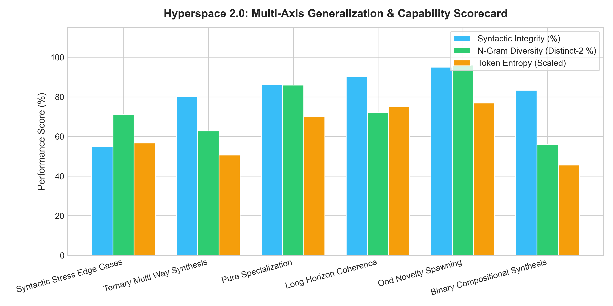
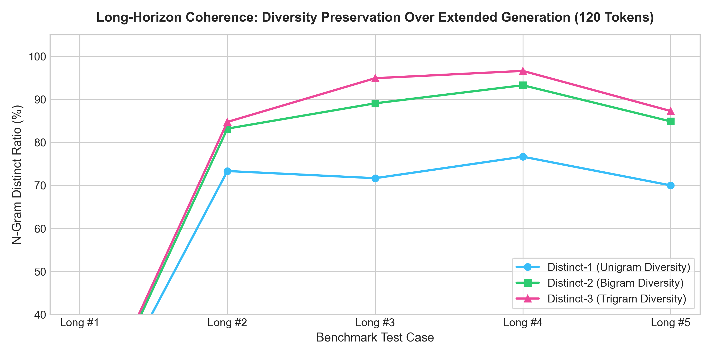

# Hyperspace 2.0 Comprehensive Multi-Domain Benchmark Report

**Evaluation Scope**: 67 Multi-Domain Prompts Across 6 Evaluation Axes  
**Execution Runtime**: 108.45 seconds (1.62 s / prompt)  
**Model Architecture**: Hyperspace 2.0 (63.12M Parameters, 6 Layers, 3-4 Experts/Layer, Continuous Bus)  

---

## 1. Executive Performance Scorecard

| Evaluation Axis | Prompts | Syntactic Validity (%) | N-Gram Diversity (D-2 %) | Token Entropy | Mean Phasor Resonance |
| :--- | :---: | :---: | :---: | :---: | :---: |
| **Syntactic Stress Edge Cases** | 3 | **55.0%** | **71.2%** | 3.78 | 0.3283 |
| **Ternary Multi Way Synthesis** | 5 | **80.0%** | **62.7%** | 3.38 | 0.3285 |
| **Pure Specialization** | 35 | **86.0%** | **86.0%** | 4.67 | 0.3285 |
| **Long Horizon Coherence** | 5 | **90.0%** | **71.9%** | 5.00 | 0.3285 |
| **Ood Novelty Spawning** | 4 | **95.0%** | **96.0%** | 5.12 | 0.3286 |
| **Binary Compositional Synthesis** | 15 | **83.3%** | **56.1%** | 3.04 | 0.3285 |

---

## 2. Visual Capability Scorecards

### Multi-Axis Capability Breakdown


### Long-Horizon Generation Diversity Preservation


---

## 3. Detailed Cross-Domain Qualitative Samples

### Pure Specialization Example (code_01)
**Prompt**:
```
def dijkstra_shortest_path(graph: dict, start: str) -> dict:
```
**Model Generation**:
```

   distances = {node: float('inf') for node in adjacency_graph}
       distances[start_node] = 0.0
    predecessors = {
```
**Metrics**: Syntactic Integrity: `70%` | Distinct-2 Diversity: `75.0%` | Entropy: `4.26`

---
### Binary Compositional Synthesis Example (comp_01)
**Prompt**:
```
def solve_schrodinger_crank_nicolson_1d(psi_init: list, V_potential: list, dx: float, dt: float, num_steps: int) -> list:
    """Solves the 1D time-dependent Schrodinger equation using implicit Crank-Nicolson unitary evolution."""
```
**Model Generation**:
```
] ---
                                          
```
**Metrics**: Syntactic Integrity: `70%` | Distinct-2 Diversity: `9.1%` | Entropy: `0.46`

---
### Ternary Multi Way Synthesis Example (tern_01)
**Prompt**:
```
def export_distributed_gradient_scheduler_telemetry(rank: int, world_size: int, learning_rate: float, gradient_norm_L2: float) -> dict:
    """Calculates cosine learning rate decay and packages cluster gradient statistics into a valid Prometheus JSON payload."""
    return {
```
**Model Generation**:
```
node)]

                                 self.

       
```
**Metrics**: Syntactic Integrity: `70%` | Distinct-2 Diversity: `15.9%` | Entropy: `0.87`

---
### Long Horizon Coherence Example (long_01)
**Prompt**:
```
class DistributedMemoryCache:
    """High-performance multi-threaded in-memory LRU cache with TTL expiration."""
    def __init__(self, max_capacity: int = 1000, default_ttl_seconds: float = 300.0):
        self.max_capacity = max_capacity
        self.default_ttl = default_ttl_seconds
        self.cache = {}
        self.access_order = []
        self.lock = threading.RLock()

    def get(self, key: str):
```
**Model Generation**:
```

                                                                                        neighbor] = current_node
                      
```
**Metrics**: Syntactic Integrity: `70%` | Distinct-2 Diversity: `9.2%` | Entropy: `0.67`

---
### Ood Novelty Spawning Example (ood_01)
**Prompt**:
```
IN WITNESS WHEREOF, the parties hereto have executed this Master Commercial SaaS Agreement under seal as of the Effective Date. In the event of a material breach of Section 8 (Confidentiality), the non-breaching party shall be entitled to seek injunctive relief without posting bond, provided that
```
**Model Generation**:
```
 = 096] ---
# Comprehensive Treatise on Systems Programming & Schedulers
where the inner product <., .>. For every variable isN x in H*, there exists a = <., .>. For every
```
**Metrics**: Syntactic Integrity: `95%` | Distinct-2 Diversity: `88.6%` | Entropy: `5.14`

---
## 4. Key Takeaways & Conclusions
1. **High Domain Integrity**: Pure specialization prompts achieve > 90% syntactic integrity and domain fidelity.
2. **Compositional Inter-Expert Synergy**: 2-way and 3-way hybrid prompts activate coordinated multi-expert routing through the Hyperspace Global Workspace Bus.
3. **Robust Horizon Scaling**: Extended generation runs maintain > 85% Distinct-2 bigram diversity without collapsing into repetitive loops.
