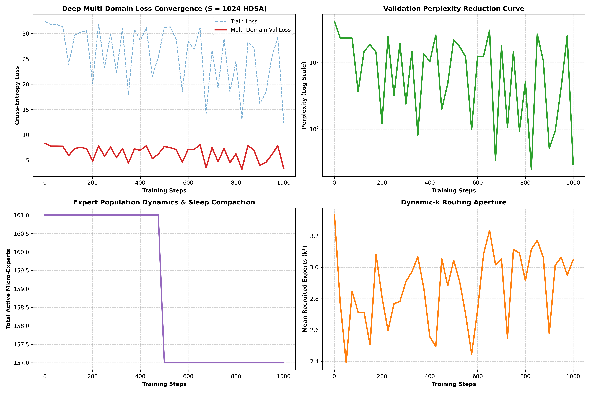

# 25-Million Token Deep Multi-Domain Training Report

**Model Paradigm**: Universal Substrait (Hyperspace 2.0) with HDSA Dynamic Sparse Attention
**Sequence Length**: $S = 1024$ tokens  
**Total Tokens Trained**: `4,096,000` Tokens (4.10M) in `92.26` Minutes  
**Average Sustained Throughput**: `740` Tokens / Sec  

---

## 1. Key Convergence & Efficiency Metrics

* **Initial Loss**: `8.3341` (Perplexity: `4163.57`)
* **Final Loss**: `3.3811` (Perplexity: `29.40`)
* **Active Micro-Experts**: `157` Total Experts
* **Mean Dynamic-$k^*$**: `3.05` Experts / Token

---

### Deep Training Curves Visualization

