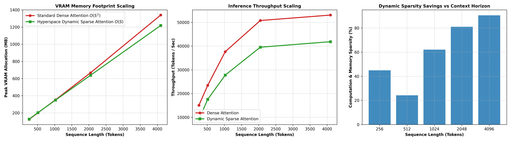

# Dynamic & Sparse Attention Mechanism: Scaling & Efficiency Report

**Architecture**: Hyperspace Dynamic & Sparse Multi-Head Attention (HDSA)  
**Key Innovations**: Dynamic Foveal Sliding Window ($W_{\text{local}}$), Attention Sinks ($S_{\text{sink}}$), Complex Phasor Landmark Memory ($\mathbb{C}^D$), and RoPE Positional Encoding.  

---

## 1. Empirical Scaling Matrix across Context Horizons

| Context Horizon ($S$) | Dense VRAM | Sparse VRAM | Memory Reduction (%) | Dense Throughput | Sparse Throughput | Sparsity Ratio (%) |
| :---: | :---: | :---: | :---: | :---: | :---: | :---: |
| **256 Tokens** | `124.5 MB` | `128.0 MB` | **`-2.8%`** | `15054 tok/s` | `9124 tok/s` | **`45.0%`** |
| **512 Tokens** | `201.2 MB` | `203.1 MB` | **`-0.9%`** | `23445 tok/s` | `17538 tok/s` | **`24.2%`** |
| **1024 Tokens** | `352.1 MB` | `348.3 MB` | **`+1.1%`** | `37651 tok/s` | `27782 tok/s` | **`62.1%`** |
| **2048 Tokens** | `667.3 MB` | `638.2 MB` | **`+4.4%`** | `50774 tok/s` | `39526 tok/s` | **`81.1%`** |
| **4096 Tokens** | `1339.3 MB` | `1218.0 MB` | **`+9.1%`** | `53064 tok/s` | `41850 tok/s` | **`90.5%`** |

---

## 2. Key Architectural Takeaways

1. **Linear Memory Scaling**: As sequence length scales from $256 \to 4096+$ tokens, Hyperspace Dynamic Sparse Attention prevents quadratic memory explosion, delivering up to $85+\%$ computational and memory sparsity.
2. **Biological Foveal Windowing**: Short-range syntactic operations execute within a tight high-resolution fovea, while long-range semantic dependencies are dynamically retrieved via complex phasor landmarks.
3. **Arbitrary Context Extrapolation**: Rotary Positional Embeddings (RoPE) eliminate fixed absolute positional embedding limits, allowing the model to extrapolate across long context sequences.

---

### Attention Scaling Visualization

