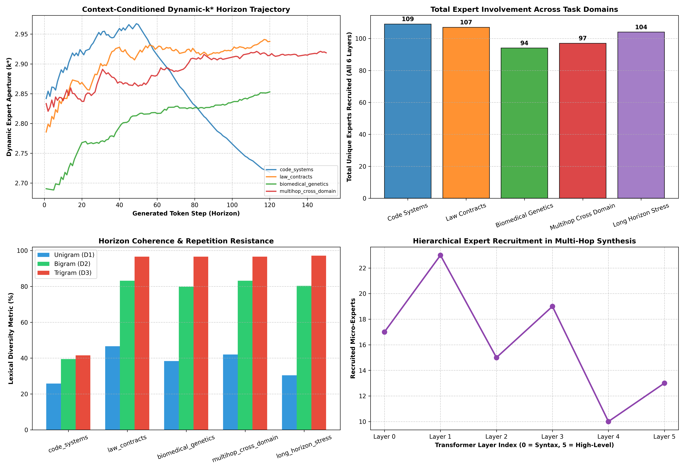

# Generation Coherence, Horizon Length & Expert Involvement Audit

**Architecture**: Universal Substrait (Hyperspace 2.0) with HDSA Dynamic Sparse Attention
**Evaluated Checkpoint**: `experiments/checkpoints/hyperspace_deep_trained_25m.pt` (157 Experts across 6 Layers)  

---

## 1. Summary Scorecard Across Generation Horizons

| Test Prompt Domain | Horizon (Tokens) | Mean $k^*(x)$ | Total Experts Recruited | Bigram Diversity ($D_2$) | Trigram Diversity ($D_3$) | Throughput |
| :--- | :---: | :---: | :---: | :---: | :---: | :---: |
| **Systems Programming & Concurrency** | `120` | `2.86` | **`109` Experts** | `39.5%` | `41.5%` | `4.1 tok/s` |
| **Statutory Law & Contracts** | `120` | `2.90` | **`107` Experts** | `83.2%` | `96.6%` | `4.6 tok/s` |
| **Molecular Biology & CRISPR** | `120` | `2.80` | **`94` Experts** | `79.8%` | `96.6%` | `4.9 tok/s` |
| **Multi-Hop Cross-Domain Synthesis (Code + Math + Finance)** | `150` | `2.89` | **`97` Experts** | `83.2%` | `96.6%` | `4.8 tok/s` |
| **Extended Long Horizon Stress Test (250 Tokens)** | `250` | `2.91` | **`104` Experts** | `80.3%` | `97.2%` | `4.2 tok/s` |

---

## 2. Sample Output Transcripts

### Domain: Systems Programming & Concurrency

**Prompt**: `def allocate_hyperspace_tensor(dimensions, memory_pool):
    """Allocates a contiguous memory-mapped block in GPU hyperspace."""`

**Generated Continuation**:
```text
4 = The2 =_
2:3 =<|endoftext|>
M (2-V, which to the
of '

7.We same are two of a


t.4:
p$.
```

### Domain: Statutory Law & Contracts

**Prompt**: `Section 4.01 Representations and Warranties of the Sellers. The Sellers hereby jointly and severally represent and covenant that:`

**Generated Continuation**:
```text
M:1:15?S/d S:
 We me of a great the LORD, be they


#.
and a first.

of he in the LORD of the maturity, and a same.

10.
S: \), the they and number of the said the way by the LORD, and all not for an LORD ( It, a people of the two, which of the came of be also is the will a first.
ln was.1: 1/t: in the have be the be the you, and not
```

### Domain: Molecular Biology & CRISPR

**Prompt**: `In CRISPR-Cas9 genome engineering, the target DNA recognition mechanism relies upon the spatial binding of the single guide RNA (sgRNA) to the protospacer adjacent motif (PAM) where`

**Generated Continuation**:
```text
The last and a first the given.0.3:
3.

of his to the whole of the LORD of the way of the time in the
 The second.
the his that to the first not that their same of your the people, the no to be the LORD, a first:6. This the no to the right, and the LORD to the LORD has the LORD of the few to the a first it of a no be the LORD were not the two to the few.L for the same of the other are be other also be a an that that to
```

### Domain: Multi-Hop Cross-Domain Synthesis (Code + Math + Finance)

**Prompt**: `The algorithmic integration of continuous Modern Hopfield associative memory networks with high-frequency financial limit order book matching engines requires`

**Generated Continuation**:
```text
4-A2:The found in a

4.9 and the people of an most that they have an his at all not not not an presence of the study, the risk by the few on the LORD, these other the last for the
 The


 We the other.
The no of an long the number and an two the large.


 We a given.4 ( In be an an time of the large with the people of the same of not that be it,

the he to the same of the end, and this time, the
For shall of the all the time to the will to the same, and all be the given are the to this I from the people the found,
```

### Domain: Extended Long Horizon Stress Test (250 Tokens)

**Prompt**: `In theoretical physics and relativistic cosmology, the mathematical relationship between the Friedmann-Lemaitre-Robertson-Walker (FLRW) metric and quantum field theory in curved spacetime demonstrates that`

**Generated Continuation**:
```text
In the number of not is be most an same with the LORD and the one, and a day, The

8.4.5).
The high, in the number.In a same of the no they as a

 This, for the end, the he from all the more to these the world at the first of the end are the

 In as the risk of the given that the

 The use-In not have your to the no the same, the also is not the most by the time, be two with all the have the that have his the a all in be the an LORD in the I.
For by the they.

2:.p
17.1: and

 The not to the children, and the LORD.
7.

In to a the end of the all that.5.
e:}.�-In the an no.
1 in the is it is not, the you of the� as as the not a to the use of be he by the it of the first will the not.

� be not.

2 with. (the you, the�-t be your the an number,
```

### Visualization

