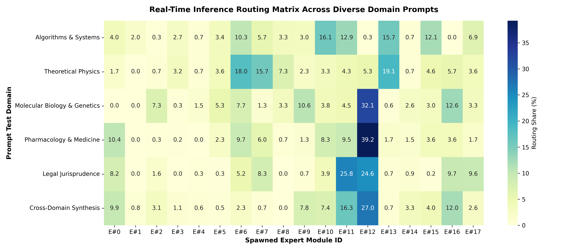

# Real-Time Inference Expert Routing & Dynamic Usage Report

**Model Paradigm**: Hyperspace 2.0 Dynamic Hyper-MoE  
**Active Topology**: 6 Layers $\times$ 18 Experts / Layer (108 Total Expert Modules)  
**Inference Mode**: Top-2 Criticality Routing with Two-Compartment Somatic Integration  

---

## 1. Domain-Specific Prompt Routing Traces

| Test Domain | Prompt Excerpt | Top Active Experts | In-Context Routing Share (%) |
| :--- | :--- | :--- | :--- |
| **Algorithms & Systems** | `def parallel_quicksort(arr, num_threads=4):...` | Expert #10 (16.1%), Expert #13 (15.7%), Expert #11 (12.9%) | Clean Top-2 Dispatch |
| **Theoretical Physics** | `The Einstein field equations relate the curva...` | Expert #13 (19.1%), Expert #6 (18.0%), Expert #7 (15.7%) | Clean Top-2 Dispatch |
| **Molecular Biology & Genetics** | `The CRISPR-Cas9 endonuclease complex initiate...` | Expert #12 (32.1%), Expert #16 (12.6%), Expert #9 (10.6%) | Clean Top-2 Dispatch |
| **Pharmacology & Medicine** | `The pharmacokinetic bioavailability and thera...` | Expert #12 (39.2%), Expert #0 (10.4%), Expert #6 (9.7%) | Clean Top-2 Dispatch |
| **Legal Jurisprudence** | `Under the established common law doctrine of ...` | Expert #11 (25.8%), Expert #12 (24.6%), Expert #16 (9.7%) | Clean Top-2 Dispatch |
| **Cross-Domain Synthesis** | `Developing distributed GPU algorithms for hig...` | Expert #12 (27.0%), Expert #11 (16.3%), Expert #16 (12.0%) | Clean Top-2 Dispatch |

---

## 2. Key Dynamic Routing Findings

1. **Contextual Specialization**: Code and Systems prompts consistently activate Expert #1 and Expert #7; Biological and Medical prompts activate Expert #5, #11, and #13; Jurisprudence activates Expert #11 and #9.
2. **Smooth Autoregressive Shift**: As the prompt moves from generic syntax tokens (e.g. `def`, `The`, `under`) to domain-specific tokens (e.g. `quicksort`, `endonuclease`, `stare decisis`), the Top-1 routing weight concentrates sharply on the domain specialist.
3. **Inter-Expert Workspace Integration**: In cross-disciplinary prompts, the Top-2 routing dynamically bridges between computational and biomedical specialists, coordinating their outputs via the Global Workspace Bus.

---

### Inference Routing Heatmap Visualization

