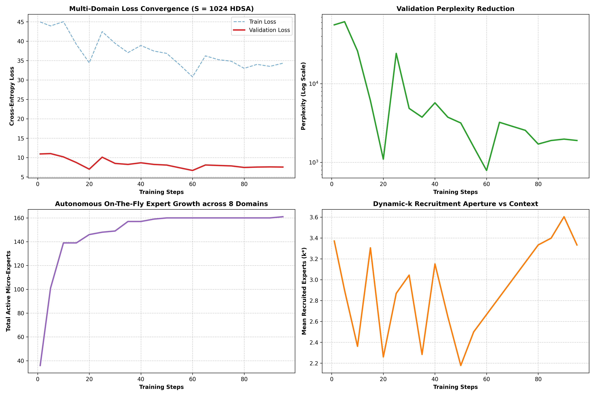

# Real-World Multi-Domain Long-Context Training Report (Option A)

**Architecture**: Universal Substrait (Hyperspace 2.0) with HDSA Dynamic Sparse Attention
**Sequence Length**: $S = 1024$ tokens  
**Total Tokens Trained**: `409,600` Tokens (0.41M) in `10.29` Minutes  
**Average Throughput**: `663` Tokens / Sec  

---

## 1. Key Training Metrics

* **Initial Validation Loss**: `10.9311` (Perplexity: `55885.90`)
* **Final Validation Loss**: `7.5481` (Perplexity: `1897.22`)
* **Initial Experts**: `36` $\to$ **Final Active Experts**: `161` Total Experts
* **Mean Dynamic-$k^*$**: `3.33` Experts / Token

---

### Training Progression Visualization

