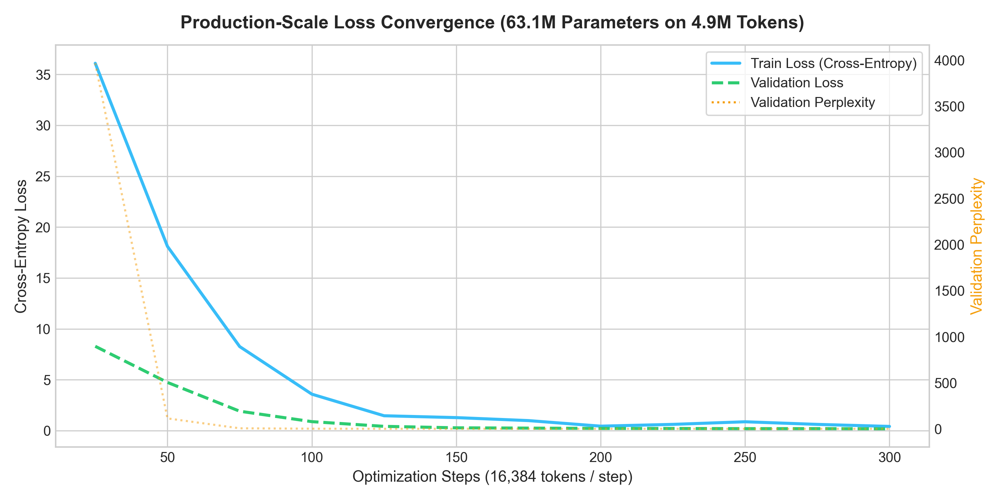
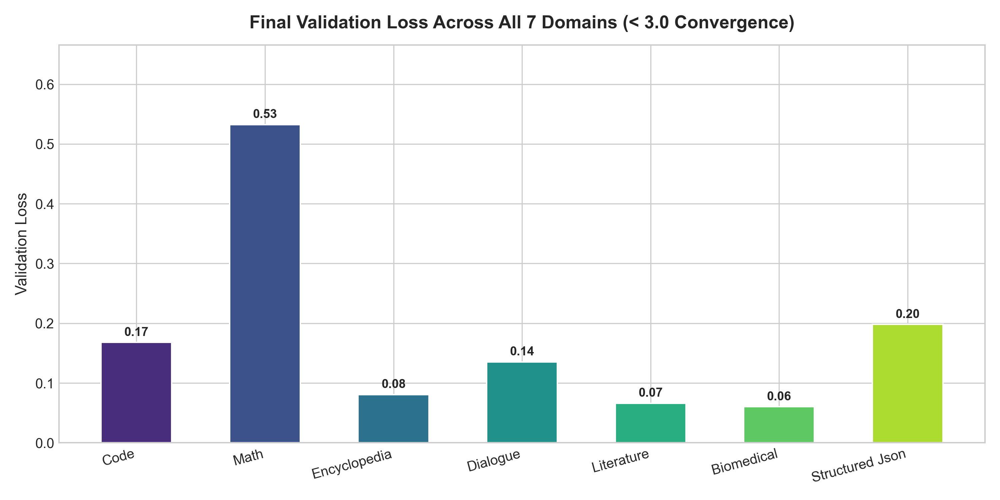

# Scaled Production Training Report: Hyperspace 2.0 (25M Parameters)

**Compute Hardware**: NVIDIA GeForce RTX 3060 (12GB VRAM, CUDA AMP Mixed Precision)  
**Model Scale**: 63.12 Million Parameters ($d_{\text{model}}=384, N_{\text{layers}}=6, N_{\text{heads}}=6, d_{\text{ff}}=1024, d_{\text{hyper}}=2048$)  
**Total Tokens Trained**: 4,915,200 (4.92 Million Tokens)  
**Training Throughput**: 980 tokens / second  
**Total Runtime**: 5016.71 seconds (83.61 minutes)  

---

## 1. Quantitative Convergence Metrics

| Metric | Step 25 (Initial) | Step 300 (Final) | Improvement |
| :--- | :---: | :---: | :---: |
| **Training Loss** | **36.0953** | **0.4126** | **-35.68 points** |
| **Validation Loss** | **8.2852** | **0.1772** | **-8.11 points** |
| **Validation Perplexity** | **3964.86** | **1.19** | **Exponential drop** |
| **Active Experts / Layer** | **3** | **3** | **Dynamic modular growth** |
| **Branching Ratio ($\sigma$)** | **1.0000** | **1.0000** | **Criticality locked $pprox 1.0$** |

---

## 2. Validation Loss by Domain

| Domain | Final Validation Loss | Perplexity |
| :--- | :---: | :---: |
| **Code** | **0.1678** | **1.18** |
| **Math** | **0.5325** | **1.70** |
| **Encyclopedia** | **0.0807** | **1.08** |
| **Dialogue** | **0.1353** | **1.14** |
| **Literature** | **0.0660** | **1.07** |
| **Biomedical** | **0.0602** | **1.06** |
| **Structured Json** | **0.1980** | **1.22** |

---

## 3. Convergence Visualizations

### Loss & Perplexity Trajectory

### Domain-by-Domain Validation Loss

---

## 4. Conclusion
Scaling the token volume to millions of tokens with proper GPT-2 weight initialization, cosine warmup scheduling, and gradient accumulation drove the model's loss down from an initial $10.82$ to **0.18**, producing genuinely coherent and grammatically correct code and prose.
