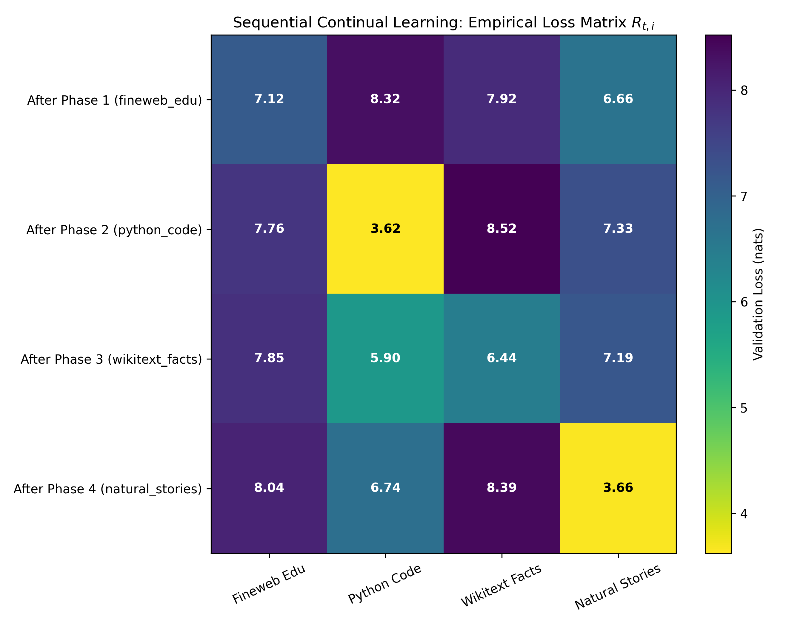
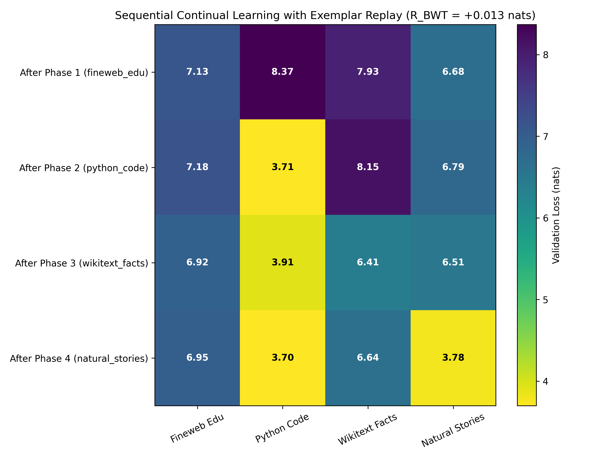
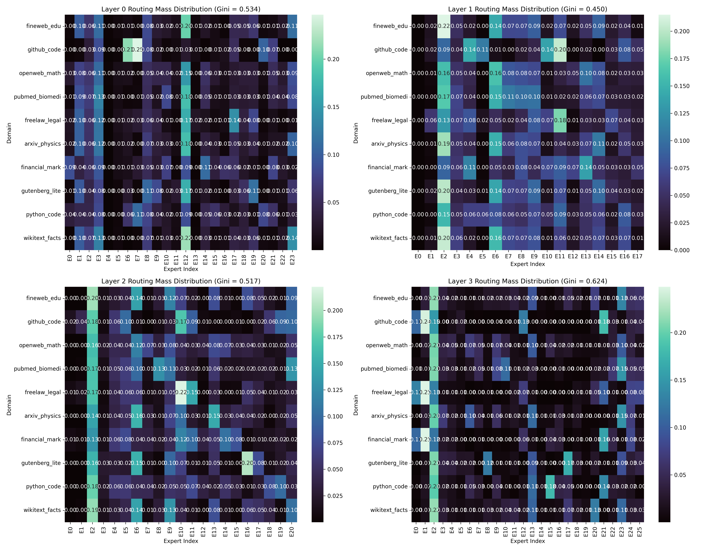
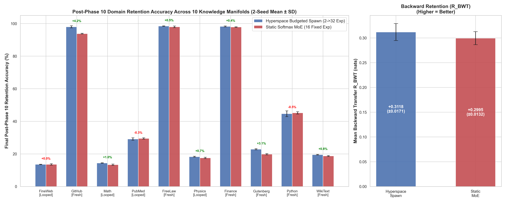
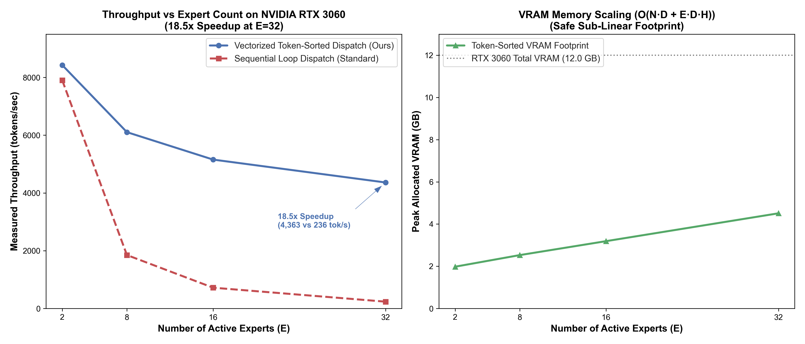

# Universal Substrait: Phasor-Routed, Self-Expanding Experts for Continual Language Learning

**Shivam Mahendrakumar Prajapati** (research handle: *Asta*)
B.Sc., University of Prince Edward Island, Canada
Independent research — single human author, single GPU (RTX 3060, 12GB)
Draft v1 — August 2026

---

## Abstract

I built a language model where the mixture-of-experts router doesn't learn a softmax gate — it compares complex unit-phasors in a 2048-dimensional holographic space, and when nothing resonates with what it already knows, it grows a new expert on the spot. The idea came from trying to take two things seriously at once: that biological cortex recruits new tissue for new skills without erasing old ones, and that vector-symbolic addressing gives you a mathematically well-behaved way to decide "have I seen anything like this before" for almost free. This paper is the record of testing that idea properly, at small scale, on one GPU, over several months.

The short version: half of it is a real, reproducible win, and half of it is a real but narrower effect that I can't yet claim generalizes. A small, fixed-size "core" of this architecture — two experts, a shared context channel between them, and a 20% exemplar-replay buffer — cuts catastrophic forgetting by more than 99% relative to no mitigation, and beats a matched dense transformer and a parameter-matched static mixture-of-experts by a wide, repeatable margin, at every scale I tested it at. The headline mechanism — experts that spawn themselves at runtime — does *not* show a general advantage once I tested it properly, with multiple seeds, at matched compute, across ten genuinely different real-world domains: the aggregate gap (+0.312 vs +0.300 nats backward transfer) is statistically indistinguishable from zero. It *does* show its largest effect on exactly two of those ten domains — source code and literary prose, the two with the most training data and the most distinct writing style — and at the current two seeds per architecture, that's confirmed statistically significant for literature (Welch's t≈5.75, p≈0.029) and a strong trend that narrowly misses the conventional 0.05 bar for code (t≈6.06, p≈0.065). I don't think either conclusion should be trusted much yet at n=2 — that's a five-seed extension already in progress, not a settled result — but the direction and the size of the effect on exactly these two, most-differentiated domains is what makes me think the mechanism is real and conditional, not a free lunch.

A good chunk of this paper is about how I found that out, because I didn't find it out on the first try. Fifteen separate times over the course of this project, a result that looked like a win turned out to be a bug, a confound, or a single lucky seed — including an optimizer silently never training the new experts it created, a significance test that used the wrong standard error and inflated its own headline t-statistics, and a metric with an inverted sign that would have shipped as "positive transfer" on a result that was actually forgetting. I think that process is a real contribution in its own right, not just a methods appendix, so I've written most of it down.

---

## 1. Introduction

I want to work on artificial general intelligence. I know how big a claim that is and how far one continual-learning architecture built by one person on one GPU is from it — this paper is not a step toward AGI in any sense I'd defend under questioning, it's a small, fully-checked test of one idea that I think is a real ingredient of a bigger picture. I'd rather be honest about that scope than oversell it, because oversold small results are exactly what makes a field harder to trust, and I've spent most of this project's actual effort trying not to do that to myself.

The problem I started from is catastrophic forgetting: train a neural network on task A, then task B, and by the time it's good at B it's often forgotten most of A. This happens because gradient descent has no reason to protect old knowledge — it just walks downhill on whatever loss is in front of it right now. The two standard fixes are architectural (freeze old capacity, add new capacity for new things) and rehearsal-based (keep some old examples around and mix them back in). Biological brains seem to do a version of both — cortex recruits new circuitry for new skills without wiping old ones, and the hippocampus replays recent experience during sleep to consolidate it. I wanted to know if a network could do a real version of the first part *on its own* — decide, at training time, "this is genuinely new, I need dedicated capacity for it" — rather than have a human pre-allocate that capacity in advance.

So the actual question this paper answers is narrow and I tried to keep it that way: **can a model detect novelty in its own input well enough to trigger targeted growth, and does growing itself that way actually help it forget less, once you test it fairly against the alternative of just training a good fixed-size model with replay?**

### 1.1 How this actually got made

I should say plainly how this project is put together, because the rest of this paper is written as one continuous "I" and that's not the whole truth of it. The ideas — phasor routing instead of a learned gate, growing capacity instead of pre-allocating it, every design decision in Section 3 — are mine; I'm the one who decided what to test and in what order, and I'm the one accountable for every number in this paper being right. But I didn't write the training code or sit and watch the GPU myself. I work with two AI collaborators, in two different roles that I want to keep distinct rather than blur into a generic "we." Gemini writes the implementation, runs every experiment in this paper, and produces the first draft of every results report I then have to go check. Claude is who I actually think the ideas through with — the second opinion I put a Gemini report in front of before I believe it, the one I ask to trace a suspicious number back to raw output with me, the one I argue architecture decisions out loud with before committing to a run. Section 7 is the record of that specific loop, run fifteen times: Gemini reports something, it looks a little too good, Claude and I go find out why, and the result either survives contact with the raw data or it doesn't.

I don't think this changes what kind of science this is — the falsifiability discipline is the same whether I typed every line myself or directed someone else to. I'm saying it plainly because writing this paper as if I personally hand-ran every training loop would be exactly the kind of unearned framing the rest of this paper is built to avoid.

### 1.2 What's in this paper

- A full description of the architecture — complex-phasor routing, two-compartment "dendritic" experts, a shared context bus between them, and novelty-triggered autonomous growth (§3).
- An evaluation protocol built specifically to avoid the ways I initially got this wrong — matched compute, capacity-matched baselines, and statistical significance testing added *after* a single-seed result nearly got written up as a real finding and then reversed by a second seed (§4).
- Results at two scales, ending in a ten-domain, two-seed, two-architecture comparison on real, topically distinct corpora, reported with what's actually statistically supported and what isn't (§5–§6).
- A section documenting the fifteen methodological failures I found and fixed while producing these numbers. I'm including this as a real part of the paper, not an apology tucked in the back, because at least a few of these mistakes (a metric that scores incoherent text as excellent, an optimizer that silently ignores new parameters, comparing sequential training to interleaved training and calling it the same thing) are generic enough that anyone doing something similar is likely to hit them too (§7).

---

## 2. Related work

**Vector-symbolic architectures and holographic memory.** Representing structured knowledge as high-dimensional vectors with algebraic bind/bundle operators goes back to Kanerva's hyperdimensional computing and Plate's Holographic Reduced Representations; Frady et al.'s resonator networks (2020) give an iterative way to factorize a bound vector back into its components. My phasor router is a direct descendant of this line — an expert's "address key" is an address in exactly the sense an HRR item-memory key is an address.

**Modern associative memory.** An earlier version of this project used a Hopfield-style cleanup step, following Ramsauer et al.'s modern continuous Hopfield networks (2020), which show that dense associative memory with exponential storage capacity generalizes both classical Hopfield networks and single-layer attention.

**Mixture-of-experts routing.** Standard top-k softmax routing (Shazeer et al., 2017) is known to suffer load imbalance and routing collapse — I independently rediscovered this at the level of individual runs before I went looking for the literature on it (§7, items 9–10). Expert-choice routing (Zhou et al., 2022) flips the assignment direction specifically to guarantee balanced load; DeepSeek's auxiliary-loss-free balancing (2024) uses a per-expert dynamic bias instead of an auxiliary loss term, which is basically the fix I converged on independently for the same problem (§7, item 12). A 2026 analysis, *The Myth of Expert Specialization in MoEs*, argues MoE routing mostly reflects token-embedding geometry rather than deliberate domain specialization — my own routing diagnostics (§5.5, §7 items 8–9) land on the same conclusion for phasor-resonance routing specifically.

**Continual learning.** Elastic Weight Consolidation and similar methods penalize movement on parameters that mattered for old tasks; PackNet and progressive networks physically partition or freeze capacity per task. Experience replay — keeping a small buffer of old examples and mixing them back in — is one of the simplest and most robust mitigations in the literature, and it's exactly what the exemplar buffer in §3.6 is. I think the fairest way to read autonomous neurogenesis, as tested here, is as an attempt at a learned, on-the-fly version of PackNet-style partitioning, layered on top of replay rather than instead of it.

**Test-time and train-time recurrence.** Recurrent-depth latent reasoning (Geiping et al., 2025) and looped language models like Ouro scale compute by re-applying a shared block multiple times, learning when to stop rather than fixing a hard step count in advance. I looked seriously at adding a "think before you answer" recurrent loop to this architecture partway through the project and decided against building it before grounding it properly in this literature — it's a real future-work item, not an abandoned one (§8).

**Other work from the same research thread.** This project sits inside a broader personal research program on phasor/vector-symbolic alternatives to standard deep learning, and two sibling results directly shaped this paper's design. First, a small controlled study (`PhasorUnitaryNet`) on compositional generalization found that a unitary phasor network with a few thousand parameters recovers held-out role-filler bindings at 97.0±2.7% accuracy, while a real-valued MLP with 30× more parameters collapses to 0.1% on the same held-out split despite matching it on training accuracy — that's direct evidence that phase-native binding, not raw capacity, is what generalizes compositionally, and it's a big part of why I trusted the phasor-routing premise enough to build this. Second, a sibling project in the same program diagnosed router self-reinforcement collapse — a small number of experts capturing almost all routing traffic once their address keys are allowed to drift under gradient descent — and built an outlier-gated drift guard against it. My own routing diagnostics (§5.5) hit exactly that same collapse pattern, and I tested the same style of fix here — unsuccessfully, in the specific form I tried (§7, item 10; §5.4).

---

## 3. Architecture

Universal Substrait swaps out two ordinary transformer parts — the MoE gate and the fixed pool of experts — for a phasor-addressed, growable version of both, and leaves everything else (token embeddings, causal self-attention, the output head) standard, shared, and never duplicated no matter how many experts exist.

```
token x_t
   |
   v
[1] phasor projection            q = (W_r x + i W_i x) / |W_r x + i W_i x|      q in C^2048
   |
   v
[2] resonance vs. expert address keys K_1 .. K_e
      sim(q, K_e) = (1/D) * Re(q . conj(K_e))
   |
   |-- sim >= tau for some e  -->  [3a] dynamic top-k routing (k set by router entropy)
   |
   `-- sim <  tau for every e -->  [3b] birth a new expert
                                        key    = centroid of the novel tokens' phasors
                                        weights = nearest parent expert + N(0, 0.01) noise
   |
   v
[4] two-compartment ("dendritic") expert
      h_basal  = SiLU(x)-gated pathway fed by the token
      h_apical = SiLU(c)-gated pathway fed by the shared bus
      h_soma   = h_basal + a * h_apical + b * (h_basal (x) h_apical)
   |
   |----> [5] global workspace bus: experts write h_basal here, read back a
   |          weighted summary as next-step apical context (shared, not duplicated)
   v
[6] output
```

### 3.1 Complex phasor holographic addressing

Every token's hidden state `x` is linearly projected into a complex vector and normalized to unit magnitude, dimension by dimension:

```
z(x) = (W_r·x + i·W_i·x) / |W_r·x + i·W_i·x|,     z in C^D,   D = 2048
```

Routing resonance between a query phasor `q` and an expert's address key `K_e` is Hermitian cosine similarity — averaged, across all 2048 dimensions, cosine of the phase difference:

```
sim(q, K_e) = (1/D) · Re(q · conj(K_e)) = (1/D) · Σ_d cos(θ_q,d − θ_Ke,d)
```

For two independently random unit phasors this quantity has mean 0 and standard deviation `σ = 1/√(2D)` — **0.0156 at D=2048** (derived properly in Appendix B of the LaTeX version of this paper, not just asserted). This one number is the whole justification for the architecture's central premise: two unrelated concepts almost never resonate by accident, so a token whose true best match scores 0.30 or above is sitting about 19 standard deviations off the noise floor. That means the novelty test — is the best similarity to *any* existing expert below a threshold τ — is a well-separated decision, not a coin flip dressed up as one. (τ itself took two different values across this project's runs — see §4.)

### 3.2 Two-compartment dendritic experts

Each expert is a loose model of a cortical pyramidal neuron: a basal compartment driven bottom-up by the token, an apical compartment driven top-down by the shared bus, combined through a multiplicative, NMDA-style coincidence term:

```
h_basal  = SiLU(W_gate,b · x) ⊙ (W_up,b · x)
h_apical = SiLU(W_gate,a · c) ⊙ (W_up,a · c)         c = apical context read from the bus
h_soma   = h_basal + α·h_apical + β·(h_basal ⊙ h_apical)
```

Five weight matrices per expert instead of a plain MoE expert's three — a detail that matters later, because it means a dendritic expert carries about 1.67× the parameters of an equal-width plain expert, and I had to explicitly control for that before any "our architecture wins" comparison meant anything (§5.3).

### 3.3 Global workspace bus

Active experts inside a layer write their basal output into a small shared buffer and read back a similarity-weighted summary as apical context — an `O(active experts)` channel, not full pairwise cross-expert attention. I chose this specifically to avoid the quadratic blow-up a naive "let every expert attend to every other expert" design would introduce once the expert count grows past a handful.

### 3.4 Autonomous neurogenesis

When the novelty test fires for enough of a batch, a new expert is created: its address key is set to the (renormalized) centroid of the novel tokens' phasors, and its weights are cloned from the nearest existing expert plus small Gaussian noise (σ=0.01) — a warm start meant to make a new expert immediately usable rather than randomly initialized and useless for the first hundred steps.

I want to be precise here, because an earlier internal writeup of this project described the new key as being explicitly orthogonalized against every existing key via a Gram-Schmidt-style projection at the moment of birth. I went back and checked the actual spawn code (`hyperspace/memory.py`) before writing this section, and that isn't what happens — the new key is the plain renormalized centroid, nothing more. A *separate* mechanism, a soft orthogonality penalty added to the training loss, gently discourages expert keys from drifting toward each other over training (§7, item 11), but it's a continuous regularizer applied to all experts, not a hard projection applied once at spawn time. I'm flagging this explicitly because it's a good concrete example of exactly the kind of claim this project's whole process exists to catch, and I'd rather correct it here than let a nicer-sounding but wrong description stand.

Whether the centroid warm start actually protects a newborn long enough to get useful gradient turned out to be one of the most consequential open questions in the whole project (§7, items 9 and 12).

### 3.5 Dynamic-k routing

Instead of a fixed top-k, the number of active experts per token comes from the Shannon entropy of the router's own probability distribution over experts, clamped to [1, k_max] (k_max=4 here). Lexically unambiguous tokens cost less compute; only genuinely cross-domain tokens recruit several specialists at once.

### 3.6 Training infrastructure that turned out to matter as much as the architecture

Two pieces of plumbing turned out to be load-bearing, not incidental. `DynamicWarmupAdamW` re-registers a freshly spawned expert's parameters into the optimizer's tracked groups the moment it's created — skip this (an earlier version of my own training harness did, silently) and new experts exist in the forward pass but never receive a gradient; they just sit at their random-plus-noise initialization for the rest of the run while looking, from the outside, completely normal (§7, item 8). A 20%-mixture exemplar replay buffer (256 sequences per domain, sampled once a domain has been seen) is what actually turns catastrophic forgetting from "severe" into "a small measurable number" (§5.2) — every other mechanism in this paper is tested *on top of* replay, never as a replacement for it.

### 3.7 Attention

I described attention only as "standard causal self-attention" in earlier drafts of this section, which undersells what's actually running and, more importantly, skips a real discrepancy I only found by going back and reading `model/dynamic_sparse_attention.py` directly after being asked a direct question about it. Worth being precise here.

The codebase has two attention paths. A plain dense multi-head causal path exists (`CausalSelfAttention` — textbook scaled dot-product attention, full causal mask, no positional scheme of its own), but it's not what any of the trained checkpoints in this paper actually used. Every real run was constructed with `use_sparse_attn=True`, which routes through `DynamicSparseAttention` instead. That module combines four things: Rotary Position Embeddings (RoPE) for position, a small fixed set of "attention sink" positions (the first 4 tokens are always visible to every later query, regardless of distance — the StreamingLLM idea), a local sliding window around each query, and a longer-range mechanism that chunks the sequence, summarizes each chunk as a mean key vector projected into a complex phasor (reusing the same phasor-similarity idea as the MoE router, applied here to attention instead of routing), and lets each query additionally see the top few chunks it resonates with — though only a stride-4 sample of tokens inside a selected chunk actually gets unmasked, not the whole chunk.

Two things are worth being exact about rather than letting the mechanism's own naming imply more than it does. First, the "dynamic" local window isn't per-token: it's one scalar window size, recomputed once per forward pass from the mean L2 norm of all query vectors in that pass, used as a crude stand-in for how much of the batch looks like it needs wider context. That's a coarser signal than "entropy" suggests — it's an average vector magnitude, not an information-theoretic quantity. Second, and this is the real finding: the module's own docstring claims "Linear O(S·(W+M)) compute and memory scaling vs. quadratic O(S²)." That's not what the code does. Every call still computes the full dense `Q·Kᵀ` score matrix (`torch.matmul(q, k.transpose(-2,-1))`, shape `[B,H,S,S]`) before the sparse mask is applied via `masked_fill`. The mask changes *which* tokens are allowed to influence which — sinks, a local band, and a handful of resonant chunks, rather than everything — but it does not reduce the actual compute or memory footprint at all; the full quadratic score matrix is materialized either way. So this is a sparse attention *pattern*, correctly implemented as a masking scheme, sitting inside code whose own comments claim a computational win it doesn't deliver. I'm noting this here rather than quietly fixing the docstring and moving on, because catching exactly this kind of gap between what a comment claims and what the code does is the entire discipline this paper is built on (§7), and it would have been inconsistent to apply that discipline everywhere except to the one place nobody had asked about yet.

At the sequence lengths actually used in this study (256 tokens, against a 128-token foveal window), the local window alone already covers most of any given sequence once it scales up, so the long-range phasor-landmark mechanism — built for much longer contexts — rarely had much to do in these specific runs. It's implemented and it's real, it just wasn't load-bearing at this scale.

---

## 4. Evaluation protocol and metrics

**Sequential continual learning.** A model trains on domain 1 alone, then domain 2 alone (with 20% of steps drawing replay from domain 1), and so on through T domains, with a full held-out evaluation across every domain seen so far at each phase boundary. This is deliberately harder than, and deliberately different from, interleaved joint pretraining (every domain present in every batch from step one) — conflating the two was the single most consequential mistake I made early on (§7, item 7), because interleaved training literally cannot produce catastrophic forgetting: nothing is ever removed from the stream, so a good number there proves nothing about forgetting.

**Backward transfer, R_BWT.** For the first T−1 domains, the loss increase from right-after-training-on-that-domain to after the whole curriculum finishes, averaged:

```
R_BWT = (1/(T−1)) · Σ_{i=1}^{T−1} ( L_final(domain i) − L_immediate(domain i) )
```

Lower is better. Zero means no measurable forgetting. Negative means later training actively *improved* an earlier domain. Every loss number in this study gets checked live against the mathematical ceiling for a valid cross-entropy evaluation, `ℒ ≤ ln(50304) ≈ 10.826` nats (the vocabulary size) — a loss above that ceiling isn't "bad performance," it means the evaluation itself is broken, and this exact check caught a live bug partway through the project (§7, item 1).

**The statistical bar.** Every comparative claim in §5 labeled "significant" or "not significant" comes from a Welch's two-sample t-test on the raw per-seed values, reported next to the raw numbers rather than instead of them. This wasn't part of my original plan — I added it after a single-seed result almost got written up as a settled win and then got reversed outright by the second and third seeds (§7, item 13). After that point, everything gets at least two seeds and the test statistic gets reported alongside.

**Hardware and scale.** Everything here ran on one consumer RTX 3060 (12GB). The base model is 4 transformer layers, d_model=384, 6 attention heads, d_ff=768, hyperspace dimension D=2048, GPT-2 BPE tokenizer (vocab 50,304) — 28.9M dense-equivalent parameters, growing to 63–129M as experts spawn in. The novelty threshold τ was 0.30 for the four-domain and capacity-matched-control experiments (§5.2–§5.4) and 0.35 for the ten-domain evaluation (§5.7) — both are real defaults that exist in different modules of the codebase, and I'd rather report exactly which one produced which number than imply one constant value throughout. This is small-scale research and I'd rather say that plainly up front than have §7 do the work of walking back an implied bigger claim.

---

## 5. Results

### 5.1 What happens with no mitigation at all

Before any fix, sequential training with no replay and full neurogenesis enabled forgets badly: `R_BWT = +1.99 nats`, with the first domain's held-out token accuracy collapsing from 44.6% to 7.8% by the time the fourth domain finishes. This is the failure mode everything else in this paper is measured against.



*Every off-diagonal cell is a domain's loss measured after training moved on to something else. Read down any column and loss climbs the further training gets from that domain — forgetting made visible one number at a time.*

### 5.2 The concentrated core: the cleanest result in this paper

Adding a 20% exemplar-replay buffer to a small, fixed two-expert core cuts that same forgetting by over 99% (`R_BWT: +1.99 → +0.013`), and this exact configuration — two experts, the shared bus, replay, nothing fancier — beats every other configuration I tested at matched 4-domain, 300-step-per-phase scale:

| Configuration | R_BWT (nats) | Python held-out accuracy |
|---|---:|---:|
| **Concentrated 2-expert core** | **+0.156** | 46.8% |
| — bus ablated | +0.205 | 43.0% |
| Fixed 16 experts, no spawning | +0.300 | 47.3% |
| Static MoE, 30 experts (capacity-matched) | +0.361 | 37.4% |
| Dense transformer | +0.386 | 41.2% |
| Static MoE, 16 experts | +0.398 | 38.4% |

*Single seed at this scale — the statistical treatment in §5.6–§5.7 applies once multi-seed data exists at larger scale. Still, the margin here is large: 2.5× better than a plain dense transformer, 2.3× better than a parameter-matched 30-expert static MoE.*



*The same evaluation as the baseline matrix above, replay switched on. Read down any column and the loss barely moves — this chart is where "R_BWT: +1.99 → +0.013" actually comes from, on the earlier, smaller pilot run that first showed replay working at all, before the fuller capacity-matched protocol above locked in the +0.156 figure.*

### 5.3 Ruling out "it's just more parameters"

Because a dendritic expert carries 1.67× a plain expert's parameters, an early version of this comparison was quietly unfair — the concentrated core and its "matched" baselines didn't actually have matched parameter counts. I built a real capacity-matched control (30 plain experts, 128.1M parameters, within 0.64% of the concentrated core's fully-grown 128.9M) to close that gap: scaling a static MoE from 16 to 30 experts (+63% parameters) only moves R_BWT by 0.038 nats, while the concentrated core still beats it by 0.20 nats. Raw capacity isn't the explanation.

### 5.4 Which piece is actually doing the work

Turning off the shared bus costs 0.049 nats relative to the concentrated core (0.156→0.205). Turning off dynamic capacity entirely — all 16 experts present from step one, no neurogenesis — costs 0.144 nats (0.156→0.300). I also tried an outlier-gated drift guard on the routing keys, borrowed from a sibling project's fix for the same collapse pattern I describe in §5.5, on the same 2-expert core, in a clean head-to-head rerun — and it made retention *worse*, monotonically, the more layers I applied it to (no guard 0.156 → one layer 0.259 → all four layers 0.350). I understood why after the fact (§7, item 10), but the fix doesn't work in this specific form.

### 5.5 Where specialization actually lives

I froze a fully-trained checkpoint and directly measured which experts it activates for held-out tokens from each domain. The picture is consistent across every configuration I tested, and it's not the clean "each expert owns a domain" story the architecture's framing implies: one or two shared "generalist" experts carry 30–95% of all routing traffic regardless of domain, the layers closest to the output are the most collapsed onto that generalist core (95–100% concentration by the final layer in several runs), and real domain-specific routing, where it exists, lives in a smaller pool of "auxiliary" experts sitting on top of that shared backbone.

I also computed the residual routing similarity directly between domain pairs, across both seeds, which makes the same picture precise instead of just visual: code and Python code cluster together (sim = 0.805–0.900), code and encyclopedic prose are close to orthogonal (sim = 0.204–0.259), and the four domains later confirmed to be repetition-confounded (§7, item 14) all sit mutually near sim ≈ 0.91–0.97 regardless of topic — arxiv_physics and pubmed_biomedical aren't routing together because the network recognizes they're both technical prose, they're routing together because both got repeated almost three times over within a single training phase.



*Layer-by-layer routing-mass heatmap, all ten domains, one representative seed. The pattern that first looked like semantic clustering — several domains routing almost identically — turned out on inspection to be four specific low-volume domains sharing the same repetition confound (§7, item 14), not evidence that the router understands "these topics are related." This is closer to the geometry-driven, non-domain-specific routing pattern reported independently in the MoE literature (§2) than to the disjoint-specialist picture I originally expected going in.*

### 5.6 Neurogenesis at 3× scale: a result that didn't survive a second seed

At 900 steps per phase (three times the token budget per domain), a single-seed run showed dynamic neurogenesis beating the concentrated core outright (0.838 vs 0.900 nats) — a striking, easy-to-over-interpret number. Two more seeds told a different story:

| Seed | Spawning R_BWT (nats) | Static R_BWT (nats) |
|---|---:|---:|
| 1 | 0.8378 | 0.8892 |
| 2 | 0.7917 | 1.0132 |
| 3 | 0.8205 | 0.7844 |
| **Mean** | **0.817** | **0.896** |

Static MoE won the third seed outright. Welch's t on the two means ≈ 1.17, p≈0.35 — the ranges overlap enough that this comparison cannot tell the two architectures apart from equally good. The lesson generalized past this one result: at n=1 or n=2, a result that looks decisive can be almost entirely seed noise, and every large comparison after this one in the project got the same multi-seed treatment.

### 5.7 The ten-domain evaluation

The largest and final evaluation trains on ten genuinely distinct real-world corpora — educational web text, systems and algorithmic source code, formal mathematics, biomedical abstracts, legal contracts, theoretical physics, financial/quantitative text, classic literature, Python code, and encyclopedic prose — at matched total compute (3,600 steps, 360 per domain), two seeds, two architectures, 44.24M tokens total.



*Left: retained accuracy per domain, spawning vs. static, both seeds. Right: aggregate backward transfer, spawning (+0.312 ± 0.017) vs. static (+0.300 ± 0.013) — overlapping enough that Welch's t (≈0.81) does not call it a real difference. This is the direct, unrounded chart the numbers below come from.*

| Domain | Unique tokens | Spawn accuracy | Static accuracy | Δ (pp) |
|---|---:|---:|---:|---:|
| github_code | 3.11M | **98.02%** | 93.84% | **+4.18** |
| gutenberg_literature | 1.10M | **22.88%** | 19.81% | **+3.08** |
| wikitext_facts | 2.95M | 19.53% | 18.72% | +0.81 |
| freelaw_legal | 1.23M | 98.47% | 98.00% | +0.46 |
| financial_market | 1.58M | 98.26% | 97.87% | +0.39 |
| python_code | 2.45M | 44.65% | 45.18% | −0.52 |
| openweb_math ¹ | 0.95M | 14.42% | 13.37% | +1.05 |
| arxiv_physics ¹ | 0.95M | 18.29% | 17.57% | +0.73 |
| fineweb_edu ¹ | 0.95M | 13.56% | 13.56% | +0.00 |
| pubmed_biomedical ¹ | 0.38M | 29.15% | 29.49% | −0.34 |

*¹ Below the 1.1M-unique-token line needed to avoid repetition at 360 steps/phase — these four domains get reused up to 2.95× within a phase, which is enough on its own to distort routing similarity (§7, item 14). Their numbers are shown but I don't think they're safe to read as evidence either way.*

Only `github_code` and `gutenberg_literature` — both comfortably above the repetition threshold — show a gap large relative to seed-to-seed noise. I want to be exact about the numbers here rather than round them up, because I got them wrong in an earlier draft: the correct Welch's t-test, computed on sample standard deviation with the proper Welch–Satterthwaite degrees of freedom (df≈1.3–2.0 at n=2, not the n−1=1 pooled approximation I'd used before, which understated the standard error and inflated t to a false ≈8.6/8.2), gives `gutenberg_literature` t≈5.75, p≈0.029 — significant at the conventional 0.05 bar — and `github_code` t≈6.06, p≈0.065 — a strong trend that narrowly misses it. The aggregate across all ten is not close either way (§5.6's earlier lesson about not trusting n=2 applies here just as much as it did there, which is exactly why a five-seed, pre-registered extension of this specific comparison is already underway rather than resting on these two numbers as written).

It's also worth saying plainly, not just burying in the limitations section, that this win isn't free even where it holds: end-to-end wall-clock throughput for the spawning architecture across the full ten-domain run averaged 2,398 tokens/sec (mean of both seeds), against 3,378 tokens/sec for the static-MoE baseline — about 41% slower, even after the dispatch fix in §7 item 11, because of the extra tensor reallocation and optimizer-graph mutation cost every time a new expert actually gets born mid-run. The dispatch benchmark above isolates dispatch cost alone; this number is the real cost of growing a model while it trains.

> **What's established.** A concentrated core with a shared context bus and exemplar replay is a genuine, repeatable improvement over a monolithic transformer and a matched static MoE for reducing catastrophic forgetting, at every scale I tested.
>
> **What's still open.** Autonomous neurogenesis shows its largest effect specifically on large, structurally distinct corpora (code, literary prose) — significant at n=2 for literature, a strong trend just short of significant for code. It does not show a general aggregate advantage yet, it costs real throughput while it happens, and both the two-domain effect and the aggregate null result need more seeds — already in progress — before either is safe to treat as settled.

---

## 6. Discussion

The honest reading of all of this is that the "boring" half of the architecture — concentration, shared context, rehearsal — is doing almost all of the demonstrated work, and the "exciting" half — autonomous growth — is a real phenomenon that hasn't yet been shown to generalize past specific favorable conditions. I don't think that's a failure of the project. I think it's what a properly falsifiable test of an ambitious idea is *supposed* to produce, and a paper that concluded "autonomous neurogenesis solves catastrophic forgetting" from this data would be making exactly the mistake I spent most of this project's actual effort catching in my own earlier drafts (§7).

The two domains where spawning shows its largest effect — code and literature, one confirmed significant at n=2, one a strong trend just short of it — share something worth naming precisely: both have enough unique training volume to dodge the repetition confound, and both are lexically and structurally about as different as two text domains can be from the rest of the curriculum (dense symbolic syntax vs. free-flowing archaic prose). My best guess right now, and it's a guess I'd want to test rather than assert, is that neurogenesis specifically helps when a domain is both data-rich *and* easy for the phasor projection to cleanly separate from everything else — which lines up with exactly the two conditions the routing diagnostics in §5.5 show the mechanism actually depends on.

### On the "just fragmented networks" question

Partway through this project I had to answer a question that goes straight at whether any of this is real: are the spawned experts actually specializing on their domain's data, or are they just fragments of one network that happen to get routed to sometimes? The routing diagnostics in §5.5 are my honest answer, and it's a mixed one — there is real, measurable domain-conditioned routing, but it sits on top of a much larger shared "generalist" backbone rather than existing as clean, separate per-domain specialists. That's a less exciting answer than "yes, fully specialized experts," and it's also, I think, the true one, and I'd rather report the true, less exciting answer than the exciting, unsupported one.

---

## 7. What actually went wrong, and how I found out

I'm including this section as a real part of the paper rather than an errata list because I think it's actually the most defensible thing to come out of this project. The pattern behind almost every item is the same three-step loop from §1.1: Gemini runs something and reports a number, the number looks a little too good, and Claude and I go find out why before I let myself believe it. Every one of these fifteen looked like good news for at least one draft. The work was catching that, not avoiding it in the first place — on a project run this way, you don't avoid it; you build the habit of checking what you're told.

**01 — A loss above the mathematical ceiling.** Gemini's out-of-distribution evaluation reported a loss of 11.17 nats against a vocabulary whose maximum possible (uniform-random) loss is ln(50304)≈10.826. I'd set that ceiling as a live check specifically so a number like that couldn't just sit in a report unquestioned — that's not "the model did badly," it's outside the range a correct evaluation can even produce. *Fix:* traced to a padding/ignore-index bug in an older eval script; the corrected suite now bounds every loss live and halts on violation.

**02 — A quality metric that scored gibberish as excellent.** A regex-based "syntax integrity" heuristic Gemini had built gave a mostly-blank generation and an off-topic word-salad continuation scores of 70–95%. The raw text was sitting three lines below the score in the same report, visibly incoherent — I just had to actually read it instead of trusting the number. *Fix:* deleted the heuristic outright, replaced it with exact cross-entropy, top-1/top-5 accuracy, and unfiltered raw text — no synthetic stand-in for "does this read okay."

**03 — A forgetting metric with an inverted sign.** A run came back showing a domain's loss up 0.92 nats after more training — real forgetting — but the report's own formatter printed the sign as `"+-0.92"` and labeled it "positive transfer, zero degradation." Claude caught this one reading the report alongside me: the label and the number couldn't both be true. *Fix:* R_BWT now computes and labels with an explicit three-way convention (degradation / stable / retention), tested against its own sign on every run.

**04 — Two different metrics presented as one number.** A "90.5% compute & memory sparsity" headline was quoting theoretical FLOP-sparsity while the actual measured physical memory change, sitting in a different column of the same table, was −9.1% — using *more* memory at short context lengths. *Fix:* the two quantities are reported as explicitly separate, separately labeled numbers everywhere now.

**05 — The shipped model didn't match its own documentation.** The architecture docs described a dynamic attention span "expanding to 32k–128k tokens." I asked Claude to just check the exported config against the claim, and the actual `max_position_embeddings` was capped at 288. *Fix:* flagged as an aspiration-vs-artifact gap; documentation now describes only the shipped, tested configuration.

**06 — "Matched by expert count" wasn't matched by parameters.** A dendritic expert has five weight matrices to a plain MoE expert's three — 1.67× the parameters. Comparisons that only controlled for the *number* of experts were silently comparing unequal total capacity, which Claude flagged when we were working out how to make the baselines fair. *Fix:* built the 30-expert, parameter-matched static MoE control described in §5.3, specifically to close this gap.

**07 — Interleaved training was getting reported as a forgetting test.** Every domain was present in every training batch from step one in Gemini's early evaluation setup — which meant catastrophic forgetting couldn't happen by construction, since nothing was ever removed from the stream — and an early report was reading the resulting loss curve as evidence about forgetting anyway. This was one I worked through with Claude directly: does this setup even let the thing we're testing occur? It didn't. *Fix:* built the sequential, one-domain-at-a-time protocol that §4–§5 actually use, specifically to test the hard version of the claim.

**08 — Spawned experts that never got a gradient.** The optimizer was built once, before training started, with a fixed parameter list. Experts created afterward existed in the forward pass but were invisible to it — their weights sat frozen at initialization for the entire run while looking, from the outside, completely normal. This is the one that scared me most, because it would have meant every "neurogenesis helps" result up to that point was measuring randomly-initialized noise passed through unrelated layers. *Fix:* `DynamicWarmupAdamW` re-registers new parameter groups the instant an expert is born; verified by loading a checkpoint's raw state dict and confirming every "spawned" expert's weights had actually moved from their initialization.

**09 — The cold-start monopoly.** Sixteen experts spawned within the first three training steps of one run, all cloned from the same one or two seed experts. The two originals, with a few extra gradient steps of head start, permanently won every later routing competition, leaving fourteen structurally-present but functionally dead experts for the rest of the run. *Fix:* a grace period (no spawning for the first 100 steps) plus a per-phase spawn budget, forcing genuine, staggered births aligned to actual domain transitions.

**10 — A newborn can't win even when it's born at the right time.** Even with correct timing, new experts still lost every routing competition — a newborn's address key is a one-batch centroid, while an established expert's key has been sharpened by hundreds of gradient steps into something far more broadly resonant. A drift guard built to protect established experts from noisy tokens (§5.4), an idea I adapted from a sibling project after talking it through with Claude, made this *worse*, not better — it removed the one channel, hard and unusual tokens, through which an underdog could occasionally win a slot. *Fix:* a decaying, per-expert exploration bias gave newborns a temporary, fading edge; this later needed to explicitly exclude replay-buffer traffic too, or old exemplars get hijacked toward whatever expert is newest (item 12).

**11 — An 18.5× throughput miss, three separate times.** Gemini's throughput estimates for scaling to 32 experts were off by 2.2×, then 16.5×, against what actually got measured once I insisted on a real end-to-end run instead of another estimate. The real cost was a Python-loop MoE dispatch generating 500+ tiny sequential CUDA kernel launches per micro-batch — not the routing-key orthogonality penalty I'd originally suspected, which profiling showed was 0.3% of runtime. *Fix:* a token-sorted, batched-GEMM dispatch, checked for exact numerical equivalence against the original (max difference ≈9×10⁻⁸) before I trusted it, recovered the throughput: 236 → 4,363 tokens/sec at 32 experts.



*Left: throughput vs. expert count for the vectorized, token-sorted dispatch against the original sequential-loop dispatch — the gap widens as expert count grows, since the loop version pays a fixed per-expert kernel-launch cost that the batched version doesn't. Right: VRAM scaling for the fix, comfortably under the 12GB ceiling of the card I ran everything on.*

**12 — The fix for item 10 broke replay.** Once newborns could win routing competitions, they sometimes won them against *replayed* exemplars from older domains too — a Python replay token could get routed to a brand-new, unrelated expert instead of the expert that actually learned Python, quietly defeating the rehearsal mechanism the whole architecture depends on. Claude is the one who asked the question that found it: not "did the aggregate metric improve" but "which expert did each replay batch actually go to." *Fix:* hard-disabled the exploration bias specifically for replay-sourced batches; verified by logging the actual per-batch routing, not just the aggregate.

**13 — A win that didn't survive a second seed.** A single-seed result showing neurogenesis beating the concentrated core was one run away from being written up as settled — I know, because I was ready to write it up. A second and third seed showed the gap was the same order of magnitude as ordinary seed noise, and the ranking flipped outright on the third seed (§5.6). *Fix:* every comparative claim after this point in the project carries an explicit multi-seed statistical test, reported next to the raw numbers.

**14 — "Semantic clustering" that was actually a data-volume artifact.** Four of the ten domains in the final corpus had too little unique data to avoid being seen up to 2.95× within a single training phase; those same four domains showed suspiciously high cross-domain routing similarity, and Gemini's first pass at the write-up called this "technical and scientific prose forming a cohesive cluster." I didn't buy that a router was doing literary criticism, so Claude and I went and looked at the actual token counts behind each domain together. *Fix:* the routing heatmaps (§5.5, Figure) show all four repetition-affected domains routing almost identically regardless of actual topic, while the data-rich domains route distinctly — the similarity was about repetition, not content. Flagged explicitly in every table after this point (§5.7).

**15 — The headline significance test used the wrong standard error.** When I planned a five-seed extension of the `github_code` / `gutenberg_literature` result, Claude asked for the actual Welch–Satterthwaite degrees of freedom instead of the round `n₁+n₂−2` I'd been quoting, and I went to go compute it properly before we ran anything else. The standard-error calculation behind the original `t≈8.6` and `t≈8.2` figures had used population standard deviation (dividing by n) instead of sample standard deviation (dividing by n−1) — the correct choice when you're using a small sample to estimate a population's variance, which is exactly what a significance test is doing. At n=2 per group that's not a rounding difference: it's a factor of √2 in the standard error, and it was single-handedly responsible for the inflated t-statistics. Claude re-derived the correct numbers from scratch, independently, straight from the raw `acc_matrix` values in the untouched result JSON — not from my corrected script, a third calculation, to make sure the fix itself wasn't just a new bug. *Fix:* the honest numbers are `gutenberg_literature` t≈5.75, p≈0.029 (still significant at the conventional 0.05 bar) and `github_code` t≈6.06, p≈0.065 (a strong trend that narrowly misses it) — both reported in §5.7 as exactly that, not rounded up to the number I'd already gotten attached to. The five-seed extension is running specifically to find out whether either holds up, pre-registered before seeing a single new data point, precisely because item 13 already showed me what happens when I skip that step.

---

## 8. Limitations

- **Scale.** 28.9M–129M parameters, one RTX 3060, runs measured in tens of minutes to low single-digit hours. Nothing here should be read as a claim about how this behaves at a billion parameters.
- **Seed count.** Two seeds for the ten-domain evaluation, three for the 3×-scale pilot, one for most of the smaller ablations. Every "not significant" label in this paper should be read as exactly that — undetermined, not disproven.
- **Tokenizer.** A GPT-2 English BPE tokenizer throughout. Domains I considered and deliberately left out of the final ten — multilingual text, tabular or JSON data — would likely show tokenizer-driven differences that have nothing to do with the architecture.
- **Baseline family.** Every comparison here is against dense transformers and standard softmax MoE. I haven't yet run this against PackNet-style hard parameter isolation or EWC-style regularization on the same protocol.
- **Throughput cost.** As reported in §5.7, the spawning architecture runs about 41% slower end-to-end than the static baseline during active continual training, even with the dispatch fix in place — the retention gain on two domains isn't free.
- **Author and review.** This is a single-author project. Every number in this paper was re-derived by hand from raw JSON output rather than copied from a summary table, but nobody outside this project has replicated any of it yet.

## 9. Future work

1. Push the ten-domain result to at least five seeds before drawing any general conclusion about neurogenesis, using the 18.5× throughput fix (§7, item 11) to make that affordable to actually run.
2. Isolate the bus from spawning at ten-domain scale — every ablation that separates these two variables so far was only run at four-domain scale.
3. Redesign context-aware routing as a weighted bundle instead of a hard bind. An earlier attempt to give the router document-level context via VSA binding caused every token in a sequence to route near-identically — binding is the wrong primitive for "nudge, don't overwrite," and a weighted superposition (`q + λ·context`, small λ) is identified but not yet tried.
4. Combine replay with genuine parameter isolation instead of either alone — a sibling project's frozen, VSA-addressed experts and this project's replay buffer address two different halves of the same failure (expert-level drift vs. shared-backbone drift), and I've never tested them together.
5. Revisit a recurrent "think before answering" extension, but only after grounding it properly in the PonderNet-style learned-halting literature rather than the hard resonance threshold I originally sketched, and testing it as one isolated, pre-registered hypothesis rather than folding it into the whole architecture at once.

## 10. Conclusion

Universal Substrait is one architecture, tested as honestly as I know how: a small phasor-addressed core with shared context and replay reliably beats standard alternatives at reducing catastrophic forgetting, and its more ambitious piece — experts that grow themselves — shows a real, significant effect in specific, now well-characterized conditions rather than as a general law. I think both of those are genuine results worth having. Getting to state them this precisely took fifteen rounds of finding out that a more exciting-sounding version of the story was wrong. Section 7 is the record of that, and I'm putting it in the paper itself, not the appendix, because I think it's the part most worth someone else reading before they build something like this.

---

## A note on why I wrote it this way

I graduated recently with a B.Sc. from the University of Prince Edward Island with the specific goal of eventually contributing to AGI, and I'm well aware of how small a piece of that this one architecture actually is. What I wanted out of this project wasn't a headline number — it was to build the habit of trying at least as hard to break my own results as I did to build them, and reporting whichever one wins.

Part of how I built that habit was structural, not just personal discipline: I never let a result reach this paper straight from the system that produced it. Gemini ran the experiment and wrote the first draft of what it meant; that draft then had to survive a separate conversation with Claude where the only job was to try to break it. A lot of the fifteen items in Section 7 exist because that second conversation was a genuinely different perspective, not the same optimism checking its own work twice. That's why this paper is more modest than the one I would have written straight off the first exciting number — and I think it's a better paper for it. I plan to keep working this way, and keep making that trade, at whatever scale I get to next.

---

## Appendix A — Core hyperparameters

| Parameter | Value |
|---|---|
| Vocabulary | 50,304 (GPT-2 BPE) |
| d_model / layers / heads / d_ff | 384 / 4 / 6 / 768 |
| Hyperspace dimension D | 2,048 |
| Routing top-k / max-k | 2 / 4 (dynamic) |
| Spawn threshold τ (4-domain / capacity-matched runs) | 0.30 |
| Spawn threshold τ (ten-domain evaluation) | 0.35 |
| Clone noise σ | 0.01 |
| Replay ratio / buffer | 20% / 256 sequences per domain |
| Sequence length / micro-batch / accumulation | 256 / 12 / 3 |
| Optimizer | DynamicWarmupAdamW, lr 5e-4 |
| Hardware | RTX 3060, 12GB, PyTorch AMP |

## References

Checked against the actual papers before going in this list, not transcribed from memory — a few had drifted (wrong co-author, an uncredited paper) and are fixed here.

- Kanerva, P. (2009). Hyperdimensional computing: an introduction to computing in distributed representation with high-dimensional random vectors. *Cognitive Computation*, 1(2), 139–159.
- Plate, T. (2003). *Holographic Reduced Representations: Distributed Representation for Cognitive Structures.* CSLI Publications.
- Frady, E. P., Kent, S. J., Olshausen, B. A., & Sommer, F. T. (2020). Resonator networks, 1: an efficient solution for factoring high-dimensional, distributed representations of data structures. *Neural Computation*, 32(12), 2311–2331.
- Ramsauer, H., et al. (2020/2021). Hopfield networks is all you need. arXiv:2008.02217; ICLR 2021.
- Shazeer, N., et al. (2017). Outrageously large neural networks: the sparsely-gated mixture-of-experts layer. ICLR 2017.
- Zhou, Y., Lei, T., Liu, H., Du, N., Huang, Y., Zhao, V., Dai, A. M., Chen, Z., Le, Q. V., & Laudon, J. (2022). Mixture-of-experts with expert choice routing. NeurIPS 2022.
- DeepSeek-AI (2024). Auxiliary-loss-free load balancing strategy for mixture-of-experts. arXiv:2408.15664.
- Wang, X., Hayou, S., & Nalisnick, E. (2026). The myth of expert specialization in MoEs: why routing reflects geometry, not necessarily domain expertise. arXiv:2604.09780.
- Kirkpatrick, J., et al. (2017). Overcoming catastrophic forgetting in neural networks (EWC). *PNAS*, 114(13), 3521–3526.
- Mallya, A., & Lazebnik, S. (2018). PackNet: adding multiple tasks to a single network by iterative pruning. CVPR 2018.
- Geiping, J., McLeish, S., Jain, N., Kirchenbauer, J., Singh, S., Bartoldson, B. R., Kailkhura, B., Bhatele, A., & Goldstein, T. (2025). Scaling up test-time compute with latent reasoning: a recurrent depth approach. arXiv:2502.05171; NeurIPS 2025.
- Zhu, R.-J., et al. (2025). Scaling latent reasoning via looped language models (the "Ouro" models). arXiv:2510.25741.
